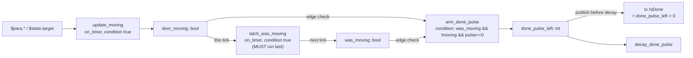
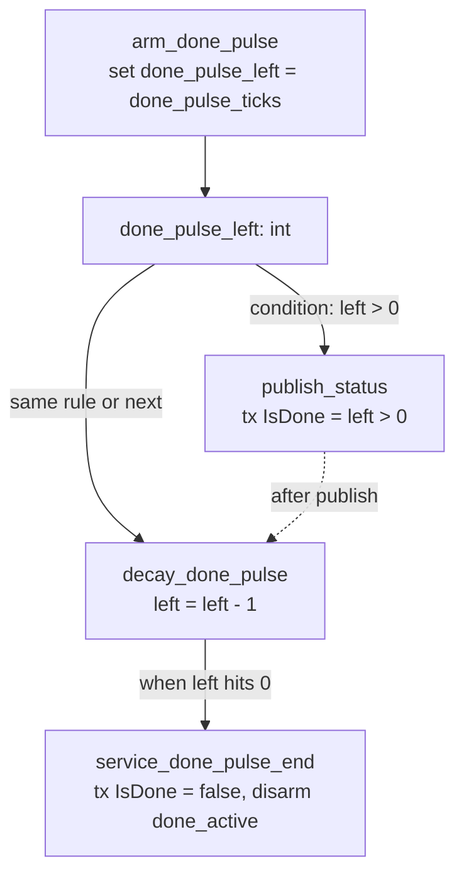

# Field relationship graph (provide → consume)

Read this **before** copying any golden YAML.

## Graph

```mermaid
flowchart TB
  subgraph PROVIDERS
    RX["can_rx signal\n[Bus]Frame.Signal"]
    TX["can_tx signal\n[Bus]Frame.Signal"]
    P["parameters.name\n→ $para.x"]
    S["state.name\n→ $state.x + set_state"]
    T["timers.name\n→ on_timer target"]
  end

  subgraph RULE
    TR["trigger.type + target"]
    C["condition expr"]
    A1["action set_state"]
    A2["action tx"]
  end

  RX -->|on_rx.target exact raw string| TR
  T  -->|on_timer.target name| TR
  RX -->|expr $[Bus]Frame.Signal| C
  P  -->|expr $para.x| C
  S  -->|expr $state.x| C
  S  -->|set_state.target name| A1
  P  --> A1
  RX --> A1
  S  --> A1
  TX -->|tx.target exact raw string| A2
  S  --> A2
  P  --> A2
```

## Authoring checklist (order)

1. Choose `ecu_mock.name`
2. List every RX signal the ECU **reads** → `can_rx`
3. List every TX signal the ECU **writes** → `can_tx`
4. List parameters (`value`) and state (`init`) and timers
5. Only then write rules:
   - `on_rx.target` must equal a `can_rx` string **exactly**
   - `on_timer.target` must equal a timer `name`
   - `set_state.target` must equal a state `name`
   - `tx.target` must equal a `can_tx` string **exactly**
   - expr may only reference declared `$state` / `$para` / `$[rx]`

## Hard edges → errors

| If you… | You get |
|---------|---------|
| write `$speed` without prefix | `E_BARE_IDENT` |
| reference `$state.foo` never declared | `E_UNRESOLVED_IDENT` |
| `on_rx` target not in can_rx | `E_TRIGGER_TARGET` |
| `tx` target not in can_tx | `E_TX_TARGET_NOT_IN_CAN_TX` |
| `set_state` unknown name | `E_SET_STATE_UNKNOWN` |
| bad signal form | `E_BAD_SIGNAL_ID` |
| call `clamp(...)` | `E_UNKNOWN_FUNCTION` |
| use two different bus names | `E_MULTI_BUS_UNSUPPORTED` |

## MVP signal read rule

`$[Bus]Frame.Signal` in expr resolves to **can_rx only**. You cannot read a TX-only signal via `$[…]` unless it is also declared in `can_rx`.

---

## Sub-graph: edge memory (1→0 detect)

Use when a TX signal must fire on a level *transition* (e.g. `IsMoving` 1→0). No
dialect primitive — implement with two state vars: a current level and a latched
prev-tick level.



Order matters: `update_moving` writes `door_moving`, `latch_was_moving` reads it
and stores for next tick, `arm_done_pulse` compares prev vs new level.

---

## Sub-graph: pulse budget FSM (one-tick or multi-tick)

Use when the high window of `IsDone` must be short (~restbus cycles), not sticky.



`done_pulse_ticks × timer_interval` must be ≥ 4 × DBC `GenMsgCycleTime` of the
receiver's frame, else the pulse disappears between restbus cycles.

Retarget during pulse: in the accept rule, also set `done_active=false`,
`done_pulse_left=0`, and TX `IsDone=false` to clear the high window.

See [`08-pulse-done.md`](08-pulse-done.md) for full YAML recipes.
