# 🔧 Remotive Behavioral Model Compiler

> **A deterministic compiler that transforms YAML behavior specs into verified Remotive Behavioral Model Python code.**

[](.github/workflows/verify.yml)
[](remotive-bm-compiler/pyproject.toml)
[]()
[](remotive-bm-compiler/pyproject.toml)

---

## 📖 Table of Contents

- [Why This Project Exists](#-why-this-project-exists)
- [The Solution](#-the-solution)
- [Architecture](#-architecture)
- [Available Recipes](#-available-recipes)
- [How to Use](#-how-to-use)
- [Verification System](#-verification-system)
- [Real-World Example: Child Presence Detection](#-real-world-example-child-presence-detection)
- [Future Vision](#-future-vision)

---

## 🎯 Why This Project Exists

### The Problem

Modern vehicles contain **6–50+ ECUs** (Electronic Control Units) that communicate via CAN bus. Simulating these ECUs for development, testing, and validation requires writing **Behavioral Model Python code** — async handlers that read CAN signals, apply logic, and write output signals via the Remotive Labs broker.

The current workflow is **manual, error-prone, and non-repeatable**:

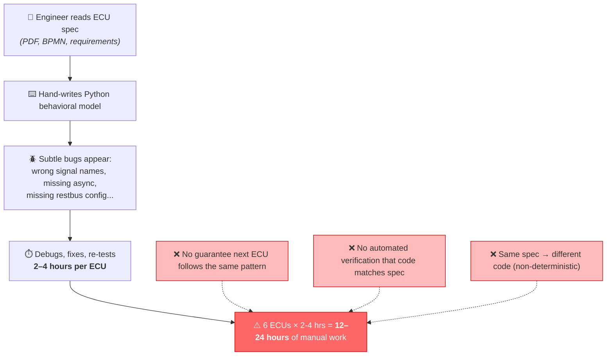

**Three core pain points:**

| Pain Point | Description | Impact |
|---|---|---|
| 🔁 **Repetitive patterns** | 80%+ of ECU handlers follow 5-6 known patterns (direct forward, toggle, blink, threshold, logic gates) | Engineers rewrite the same code structure over and over |
| 🪲 **Silent bugs** | Missing `async`, wrong namespace refs, missing `restbus` config, incorrect `FrameFilter` — these pass syntax check but fail at runtime | Hours of debugging per ECU |
| 🎲 **Non-deterministic** | Same spec → different code depending on who writes it, when, and how | No reproducibility, no CI guarantee |

### Why Not Just Use LLM/AI Code Generation?

LLM-generated code is **non-deterministic** — the same prompt can produce different code each time. This is unacceptable for safety-critical automotive software where:

- The code must be **verifiable** (every line must pass structural + behavioral + composition checks)
- The code must be **reproducible** (same spec → same code, always)
- The code must be **traceable** (every output signal maps to a known recipe pattern)

Agent/RAG layers are planned as a **future augmentation** (helping write specs and discover new patterns), but the core compilation pipeline must remain **deterministic and LLM-free**.

---

## 💡 The Solution

### The `bmgen` Compiler Pipeline

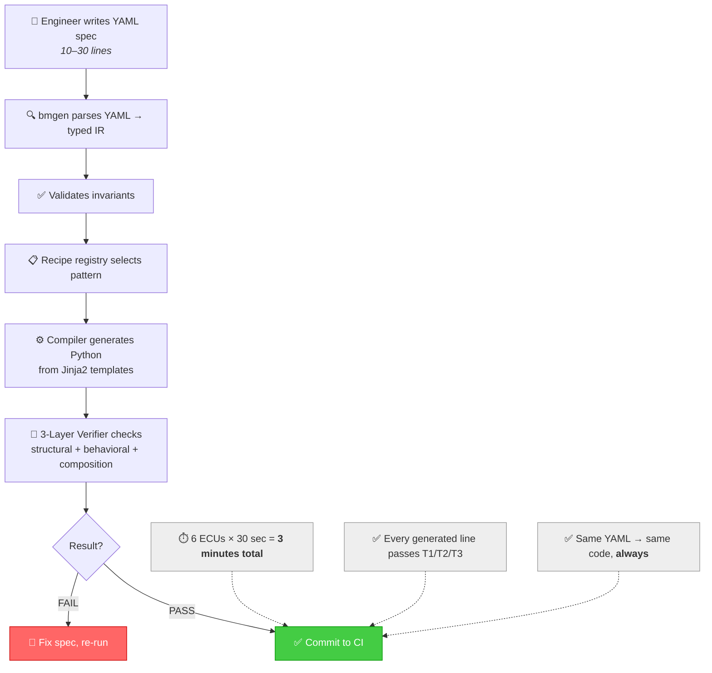

### The Core Invariant

> **No line of generated Python code in the CI path comes from an LLM.**
> All code comes from templates + recipe logic. Agent assistance may help *write recipes* or *write YAML specs*, but the compiler path remains deterministic.

---

## 🏗️ Architecture

### End-to-End Pipeline

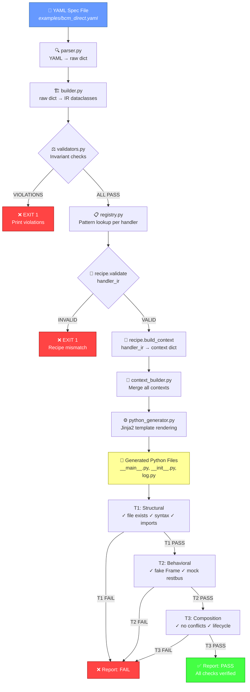

### Module Boundaries

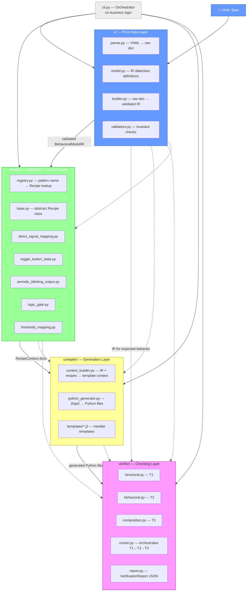

**Boundary rules:**

| Layer | Reads From | Writes To | Never Imports |
|---|---|---|---|
| `ir/` | YAML only | BehavioralModelIR dataclasses | compiler, recipes, verifier |
| `recipes/` | IR dataclasses | Context dicts (plain Python dicts) | compiler, verifier, filesystem |
| `compiler/` | IR + recipe contexts | Filesystem (Python files) | verifier |
| `verifier/` | Filesystem + IR | VerificationReport JSON | compiler, recipes (never generates code) |

### IR Data Flow (YAML → Dataclasses → Templates → Code)

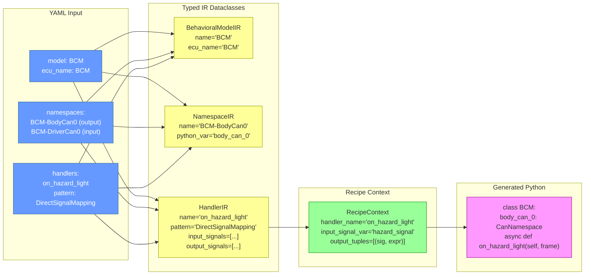

### Why Typed IR (Not Just YAML)?

| YAML (Serialization) | Typed IR (Compilation) |
|---|---|
| No type enforcement — `"BCM"` could be anything | Every field has a Python type — errors caught at build time |
| No invariant validation — duplicate names are fine | Validators enforce uniqueness, cross-refs, restbus configs |
| No behavioral semantics — a string `"DirectSignalMapping"` is just a string | Maps to a Recipe class that validates handler structure |
| No deterministic compilation — ambiguous specs | Validated IR → deterministic template rendering |

---

## 🍳 Available Recipes

Recipes are **known behavioral patterns** — the building blocks of ECU logic.

| Recipe | Pattern | Inputs | Outputs | State | Description | Real-World Example |
|---|---|---|---|---|---|---|
| **DirectSignalMapping** | `DirectSignalMapping` | 1 | ≥1 | ❌ | Read one signal → forward same value to outputs | Hazard light button → turn light request |
| **ToggleButtonState** | `ToggleButtonState` | 1 | ≥1 | ✅ (bool) | Read button → toggle boolean → write 1/0 to outputs | Hazard button press ON, press again OFF |
| **PeriodicBlinkingOutput** | `PeriodicBlinkingOutput` | 1 | ≥1 | ✅ (bool) | State enables blinking → periodic async ticker → cleanup | Turn signal blinking at 1s interval |
| **ThresholdMapping** | `ThresholdMapping` | 1 | ≥1 | ❌ | Compare analog input against threshold → output 1/0 | Seat weight > 5kg → child detected |
| **LogicAnd** | `LogicAnd` | ≥2 | ≥1 | ❌ | AND of N input signals → 0/1 result | Door locked AND seatbelt ON → safe |
| **LogicOr** | `LogicOr` | ≥2 | ≥1 | ❌ | OR of N input signals → 0/1 result | Any door open → warning |
| **LogicXor** | `LogicXor` | ≥2 | ≥1 | ❌ | XOR of N inputs (odd true) → 0/1 result | Exclusive mode selection |
| **LogicNot** | `LogicNot` | 1 | ≥1 | ❌ | NOT (invert) single input → 0/1 result | Invert enable → disable |

### Recipe Visual Pattern Map

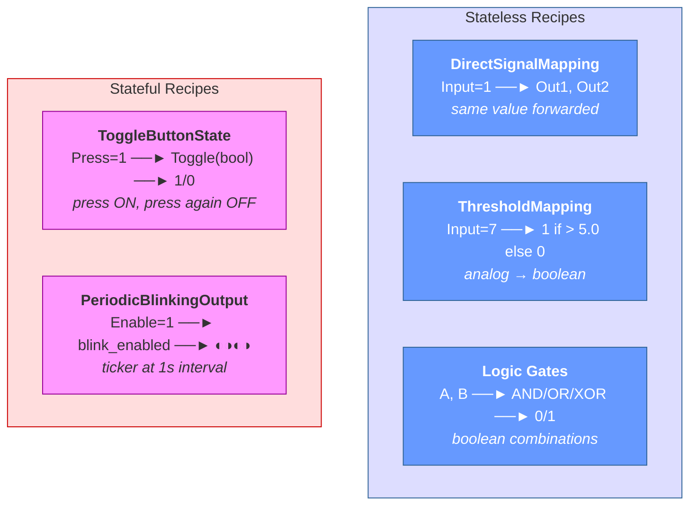

---

## 🚀 How to Use

### Installation

```bash
# Clone and install
cd remotive-bm-compiler
pip install -e ".[dev]"
```

### Step 1: Write a YAML Spec

Create a small YAML file describing ECU behavior:

```yaml
# examples/bcm_direct.yaml
model:
  name: BCM
  ecu_name: BCM

namespaces:
  - name: BCM-BodyCan0
    type: can
    role: output
    restbus:
      sender_filter: BCM
  - name: BCM-DriverCan0
    type: can
    role: input

handlers:
  - name: on_hazard_light
    pattern: DirectSignalMapping
    input:
      namespace: BCM-DriverCan0
      frame_filter: HazardLightButton
      signal: HazardLightButton.HazardLightButton
    output:
      namespace: BCM-BodyCan0
      signals:
        - TurnLightControl.RightTurnLightRequest
        - TurnLightControl.LeftTurnLightRequest
```

### Step 2: Parse & Validate

```bash
bmgen parse examples/bcm_direct.yaml
```

Output:
```text
Model: BCM (ECU: BCM)
Namespaces: 2
  - BCM-BodyCan0 (can, role=output, var=body_can_0) (restbus: sender_filter=BCM)
  - BCM-DriverCan0 (can, role=input, var=driver_can_0)
Handlers: 1
  - on_hazard_light (pattern=DirectSignalMapping, novel_logic=False)
    Input: BCM-DriverCan0 / HazardLightButton / HazardLightButton.HazardLightButton
    Output: BCM-BodyCan0 / ['TurnLightControl.RightTurnLightRequest', 'TurnLightControl.LeftTurnLightRequest']
Validation: PASS
```

### Step 3: Generate Code

```bash
bmgen generate examples/bcm_direct.yaml --out generated/
```

Output:
```text
Generated 3 files in generated/:
  - bcm/__main__.py
  - bcm/__init__.py
  - bcm/log.py
```

### Step 4: Verify Generated Code

```bash
bmgen verify generated/ --spec examples/bcm_direct.yaml
```

Output:
```text
Verification result: PASS
Checks: 13
  ✓ [structural] file_exists: PASS
  ✓ [structural] syntax_valid: PASS
  ✓ [structural] module_imports: PASS
  ✓ [structural] handler_async: PASS
  ✓ [structural] handler_accepts_frame: PASS
  ✓ [structural] namespace_refs_exist: PASS
  ✓ [structural] output_has_restbus: PASS
  ✓ [structural] input_has_frame_filter: PASS
  ✓ [behavioral] handler_callable_with_fake_frame: PASS
  ✓ [behavioral] direct_signal_mapping_output_correct: PASS
  ✓ [composition] no_duplicate_handler_names: PASS
  ✓ [composition] no_duplicate_state_ownership: PASS
  ✓ [composition] no_pattern_conflicts: PASS
```

### CLI Command Summary

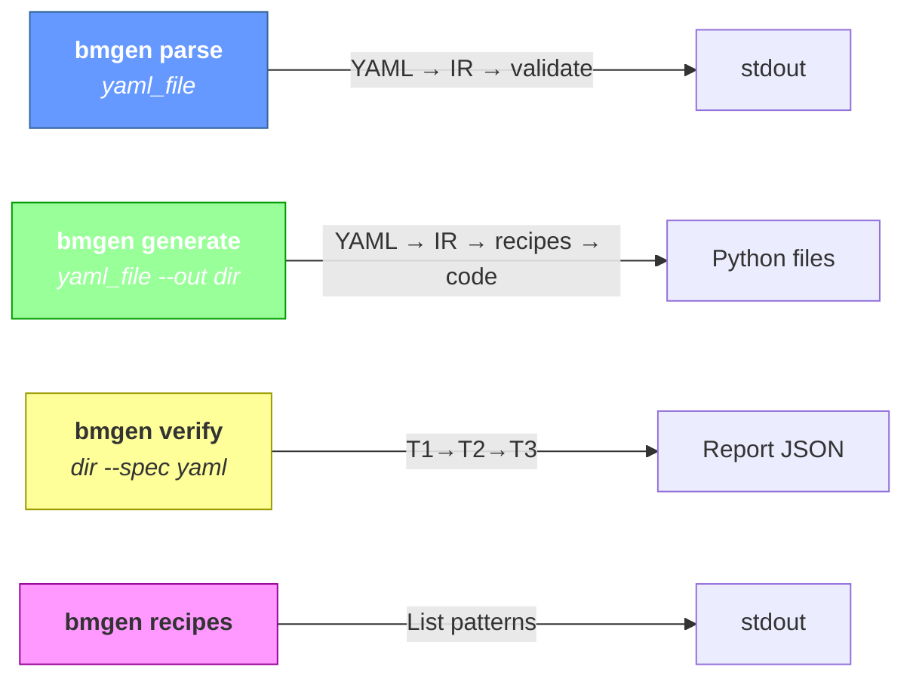

### What Gets Generated

Each YAML spec generates a complete behavioral model Python package:

```
generated/
└── bcm/
    ├── __main__.py    ← Complete behavioral model (imports, class, handlers, main(), entry point)
    ├── __init__.py    ← Package marker
    └── log.py         ← structlog configuration
```

The `__main__.py` follows the Remotive Labs behavioral model conventions:

```python
import asyncio
import logging
from dataclasses import dataclass

from remotivelabs.broker import BrokerClient, Frame
from remotivelabs.topology.behavioral_model import BehavioralModel
from remotivelabs.topology.cli.behavioral_model import BehavioralModelArgs
from remotivelabs.topology.namespaces import filters
from remotivelabs.topology.namespaces.can import CanNamespace, RestbusConfig


@dataclass
class BCM:
    body_can_0: CanNamespace

    async def on_hazard_light(self, frame: Frame) -> None:
        hazard_signal = frame.signals["HazardLightButton.HazardLightButton"]
        await self.body_can_0.restbus.update_signals(
            ("TurnLightControl.RightTurnLightRequest", hazard_signal),
            ("TurnLightControl.LeftTurnLightRequest", hazard_signal),
        )


async def main(avp: BehavioralModelArgs):
    async with BrokerClient(url=avp.url, auth=avp.auth) as broker_client:
        body_can_0 = CanNamespace(
            "BCM-BodyCan0", broker_client,
            restbus_configs=[RestbusConfig(
                [filters.SenderFilter(ecu_name="BCM")],
                delay_multiplier=avp.delay_multiplier)],
        )
        driver_can_0 = CanNamespace("BCM-DriverCan0", broker_client)
        bcm = BCM(body_can_0)
        async with BehavioralModel(
            "BCM", namespaces=[body_can_0, driver_can_0],
            broker_client=broker_client,
            input_handlers=[
                driver_can_0.create_input_handler(
                    [filters.FrameFilter("HazardLightButton")],
                    bcm.on_hazard_light,
                )
            ],
        ) as bm:
            await bm.run_forever()

if __name__ == "__main__":
    args = BehavioralModelArgs.parse()
    asyncio.run(main(args))
```

### Novel Logic Escape Hatch

When a behavior pattern isn't in the registry, mark it as `novel_logic`:

```yaml
handlers:
  - name: on_custom_logic
    pattern: CustomBehavior
    novel_logic: true
    input:
      namespace: BCM-DriverCan0
      frame_filter: CustomFrame
      signal: CustomSignal.Value
    output:
      namespace: BCM-BodyCan0
      signals:
        - CustomOutput.Signal
```

This generates a stub:
```python
async def on_custom_logic(self, frame: Frame) -> None:
    # novel_logic: implement manually
    # pattern: CustomBehavior
    # input: CustomSignal.Value from BCM-DriverCan0
    # output: CustomOutput.Signal to BCM-BodyCan0
    pass
```

Verification: T1 PASS (stub exists), T2 SKIP (novel_logic), T3 PASS (no conflicts). The report includes a warning that manual implementation is required.

---

## 🔍 Verification System

### 3-Layer Verification Architecture

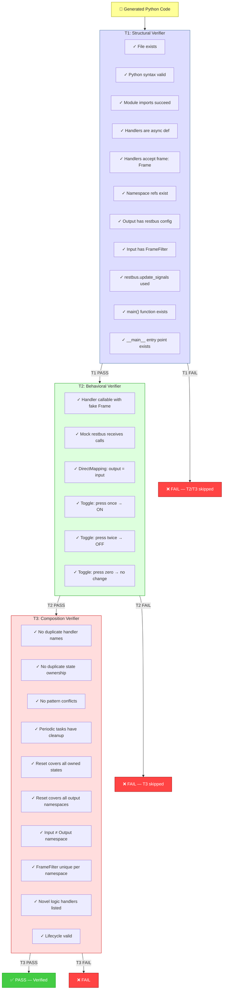

### Fail-Fast Design

The verifier runs layers in strict sequence: **T1 → T2 → T3**. If T1 fails, T2 and T3 are skipped entirely. This prevents wasting time on behavioral checks when the code is structurally broken.

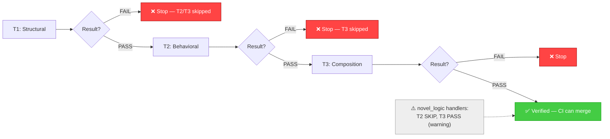

### Verification Report

Every verification produces a JSON report:

```json
{
  "status": "PASS",
  "checks": [
    {"layer": "structural", "name": "file_exists", "status": "PASS"},
    {"layer": "structural", "name": "syntax_valid", "status": "PASS"},
    {"layer": "behavioral", "name": "handler_callable_with_fake_frame", "status": "PASS"},
    {"layer": "composition", "name": "no_duplicate_handler_names", "status": "PASS"}
  ],
  "generated_files": ["generated/bcm/__main__.py"],
  "errors": [],
  "warnings": []
}
```

---

## 🚗 Real-World Example: Child Presence Detection

This project has already been applied to a real automotive use case: **Child Presence Detection (CPD)** across 6 ECUs. Each ECU's behavior was specified in a YAML file and compiled into verified Python behavioral models.

### ECU Architecture for CPD

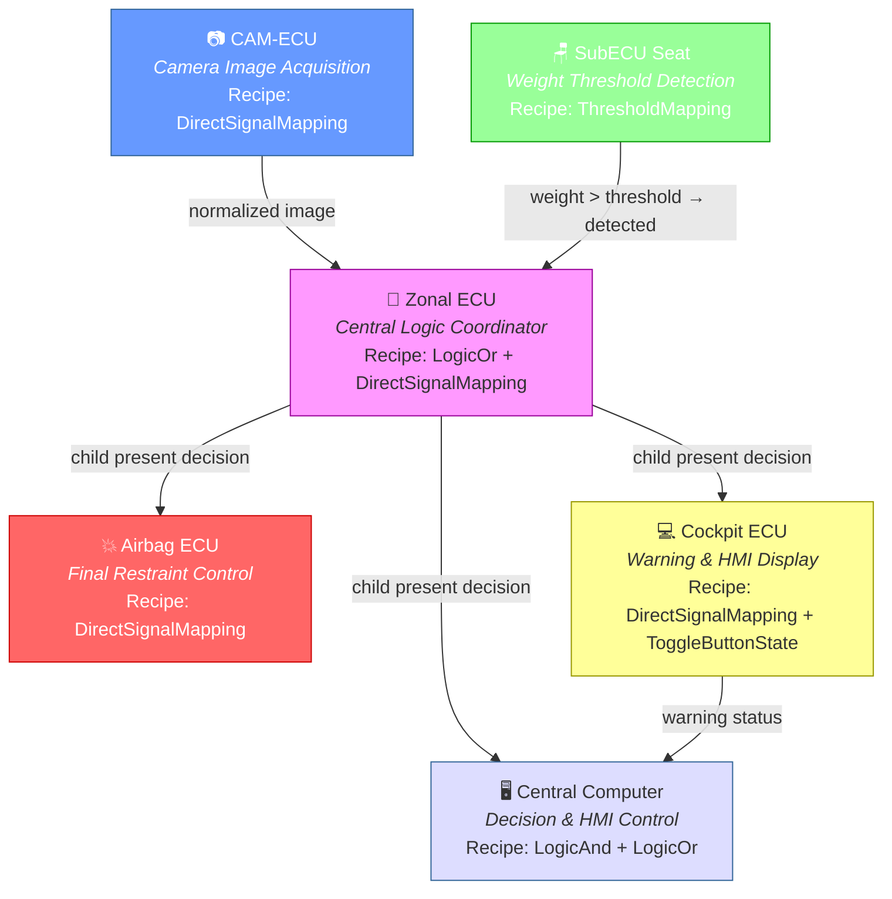

### Generated Models

The 6 ECU specs in `examples/cpd/` compile into 6 verified behavioral models in `_generated/`:

```bash
# Generate all 6 CPD models
for yaml in examples/cpd/*.yaml; do
  slug=$(basename "$yaml" .yaml)
  bmgen generate "$yaml" --out "_generated/$slug"
  bmgen verify "_generated/$slug" --spec "$yaml"
done
```

```
_generated/
├── airbag_ecu/     ← DirectSignalMapping (airbag control forwarding)
├── cam_ecu/        ← DirectSignalMapping (camera image forwarding)
├── central_computer/ ← LogicAnd + LogicOr (decision logic)
├── cockpit_ecu/    ← DirectSignalMapping + ToggleButtonState (warning)
├── subecu_seat/    ← ThresholdMapping (weight → child detected)
├── zonal_ecu/      ← LogicOr + DirectSignalMapping (central coordinator)
```

---

## 🔮 Future Vision

### Phase Roadmap

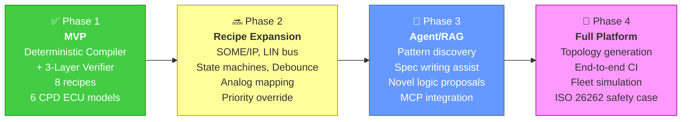

### Phase Details

**Phase 1 — Current MVP ✅**
- YAML → Typed IR → Recipe Registry → Jinja2 Templates
- 8 recipes: Direct, Toggle, Blink, Threshold, LogicAnd/Or/Xor/Not
- T1/T2/T3 verification with fail-fast pipeline
- CI integration: `bmgen verify` blocks merges on FAIL
- Real-world proof: 6 CPD ECU models verified

**Phase 2 — Recipe Expansion 🔜**
- Multi-frame handlers (SOME/IP service calls)
- LIN bus recipe patterns
- Sequence recipes (multi-step state machines)
- Debounce recipe (noise filtering on inputs)
- Analog mapping (linear interpolation tables)
- Priority override recipes (hazard overrides turn signal)
- Target: Cover 95%+ of production ECU patterns

**Phase 3 — Agent-Assisted Augmentation 🔮**

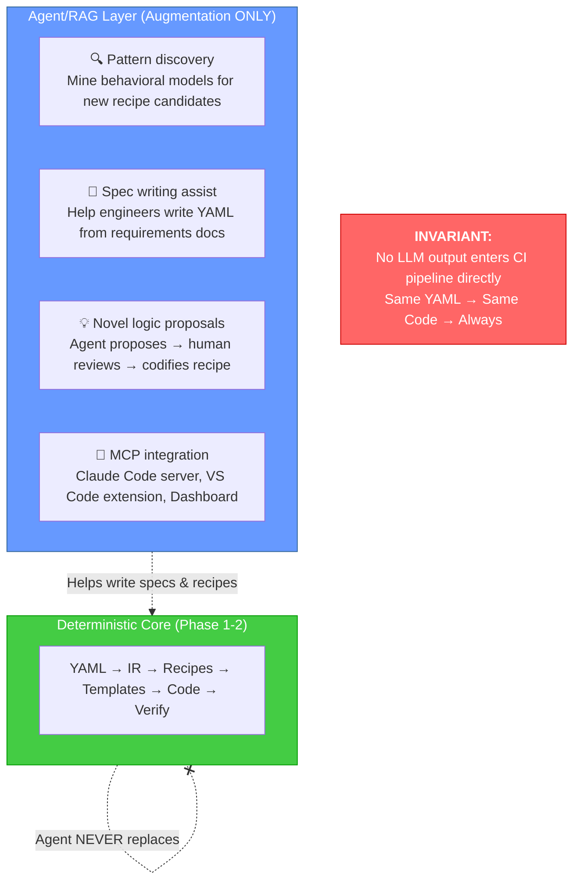

**Phase 4 — Full Automotive Simulation Platform 🌟**
- Auto-generate topology YAML from behavioral model specs
- End-to-end CI: spec → code → topology → test → deploy
- Fleet simulation: run 6+ ECUs simultaneously
- CAN signal database integration (.arxml/.dbc parsing)
- OTA update simulation: behavioral model hot-swap
- Safety case generation: verification report → ISO 26262

### Key Design Principle Across All Phases

> **The deterministic compiler + verifier is the foundation.**
> Agent/RAG/MCP layers wrap around it, augment it, and help humans use it more effectively — but they never replace the deterministic core pipeline. The invariant holds across all future phases:

> **Same YAML → Same Code → Same Verification → Same CI Decision. Always.**

---

## 📚 Documentation

| Document | Description |
|---|---|
| [MVP_PLAN.md](docs/architecture/MVP_PLAN.md) | Problem statement, goals, scope, milestones |
| [ARCHITECTURE.md](docs/architecture/ARCHITECTURE.md) | Module breakdown, boundaries, design rationale |
| [WORKFLOW.md](docs/architecture/WORKFLOW.md) | Developer workflow, CLI usage, CI |
| [DATAFLOW.md](docs/architecture/DATAFLOW.md) | End-to-end dataflow with Mermaid diagrams |
| [IR_SCHEMA.md](docs/architecture/IR_SCHEMA.md) | Typed IR, YAML schema, validation rules |
| [VERIFIER_DESIGN.md](docs/architecture/VERIFIER_DESIGN.md) | 3-layer verifier design |

---

## 🧪 Running Tests

```bash
# Install with dev dependencies
pip install -e ".[dev]"

# Run full test suite
pytest tests/ -v

# Run specific test categories
pytest tests/test_ir_validation.py -v       # IR invariant tests
pytest tests/test_compile_direct_mapping.py -v  # DirectSignalMapping generation
pytest tests/test_verify_generated.py -v     # Verification pipeline tests
```

---

## 📜 License

MIT
