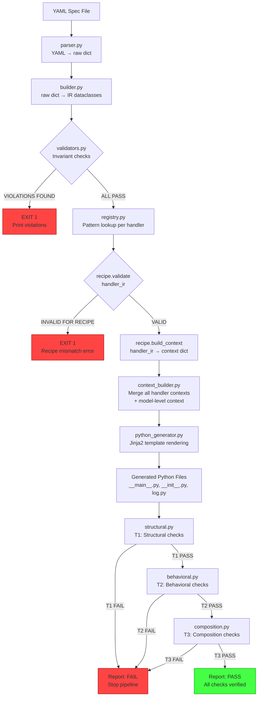

# Dataflow — Remotive Behavioral Model Compiler

## End-to-End Dataflow

### Mermaid Diagram: Main Pipeline



### Mermaid Diagram: Failure Paths

```mermaid
flowchart TD
    subgraph "IR Validation Failures"
        V1[Duplicate namespace name] --> E1[Invariant violation]
        V2[Duplicate handler name] --> E1
        V3[Handler references non-existent namespace] --> E1
        V4[Output namespace missing restbus config] --> E1
        V5[State field has multiple owners] --> E1
        V6[Periodic task missing cleanup] --> E1
        V7[Resettable state missing reset value] --> E1
    end

    subgraph "Recipe Validation Failures"
        R1[Unknown pattern name] --> E2[Recipe not found in registry]
        R2[DirectSignalMapping with state fields] --> E3[Recipe mismatch:<br/>pattern requires no state]
        R3[ToggleButtonState without boolean state] --> E3
        R4[PeriodicBlinkingOutput without cleanup] --> E3
    end

    subgraph "Verification Failures"
        T1a[Generated file missing] --> T1F[T1 Structural FAIL]
        T1b[Syntax error in generated code] --> T1F
        T1c[Import fails] --> T1F
        T1d[Handler not async] --> T1F
        T1e[Handler missing frame param] --> T1F
        T1f[Namespace ref not found in code] --> T1F
        T1g[Output namespace lacks restbus] --> T1F

        T2a[Handler crashes with fake Frame] --> T2F[T2 Behavioral FAIL]
        T2b[restbus.update_signals not called] --> T2F
        T2c[Wrong signal values in output] --> T2F
        T2d[Toggle does not flip on second press] --> T2F

        T3a[Duplicate handler names in model] --> T3F[T3 Composition FAIL]
        T3b[State owned by multiple handlers] --> T3F
        T3c[Pattern conflict:<br/>two handlers write same signal] --> T3F
        T3d[Periodic task without cleanup] --> T3F
        T3e[Reset handler missing for owned states] --> T3F
    end

    E1 --> EXIT1[CLI exit code 1]
    E2 --> EXIT1
    E3 --> EXIT1
    T1F --> FAIL_REPORT[VerificationReport JSON<br/>status: FAIL]
    T2F --> FAIL_REPORT
    T3F --> FAIL_REPORT
    FAIL_REPORT --> CI_BLOCK[CI blocks merge]
```



### Mermaid Diagram: `novel_logic` Escape Hatch

```mermaid
flowchart TD
    A[YAML Spec with unknown pattern] --> B[parser.py → raw dict]
    B --> C[builder.py → IR]
    C --> D[validators.py: unknown pattern detected]
    D --> E{Is pattern in registry?}
    E -->|NO| F[novel_logic flag set in IR]
    F --> G[EXIT 1:<br/>"Pattern 'CustomBehavior' not in registry.<br/>Mark as novel_logic or implement recipe."]
    E -->|YES| H[Continue normal pipeline]

    A2[YAML Spec with novel_logic marker] --> B2[parser.py → raw dict]
    B2 --> C2[builder.py → IR with novel_logic=True]
    C2 --> D2[validators.py: novel_logic accepted]
    D2 --> E2{novel_logic flag?}
    E2 -->|YES| F2[Generate stub handler:<br/>async def on_custom(self, frame):<br/>    # novel_logic: implement manually<br/>    pass]
    F2 --> G2[T1 PASS (stub exists)<br/>T2 SKIP (novel_logic)<br/>T3 PASS (no conflicts)]
    G2 --> H2[Report: PASS with novel_logic warnings]

    style G fill:#f84,stroke:#900
    style H2 fill:#ff4,stroke:#990
```

## Data Structures Flow

### YAML → Raw Spec Dict

Input (YAML):
```yaml
model:
  name: BCM
  ecu_name: BCM
namespaces:
  - name: BCM-BodyCan0
    type: can
    role: output
    restbus:
      sender_filter: BCM
handlers:
  - name: on_hazard_light
    pattern: DirectSignalMapping
    input:
      namespace: BCM-DriverCan0
      frame_filter: HazardLightButton
      signal: HazardLightButton.HazardLightButton
    output:
      namespace: BCM-BodyCan0
      signals:
        - TurnLightControl.RightTurnLightRequest
        - TurnLightControl.LeftTurnLightRequest
```

Output (raw dict):
```python
{
    "model": {"name": "BCM", "ecu_name": "BCM"},
    "namespaces": [
        {"name": "BCM-BodyCan0", "type": "can", "role": "output", "restbus": {"sender_filter": "BCM"}},
        {"name": "BCM-DriverCan0", "type": "can", "role": "input"}
    ],
    "handlers": [
        {
            "name": "on_hazard_light",
            "pattern": "DirectSignalMapping",
            "input": {
                "namespace": "BCM-DriverCan0",
                "frame_filter": "HazardLightButton",
                "signal": "HazardLightButton.HazardLightButton"
            },
            "output": {
                "namespace": "BCM-BodyCan0",
                "signals": [
                    "TurnLightControl.RightTurnLightRequest",
                    "TurnLightControl.LeftTurnLightRequest"
                ]
            }
        }
    ]
}
```

### Raw Dict → IR Dataclasses

```python
BehavioralModelIR(
    name="BCM",
    ecu_name="BCM",
    namespaces=[
        NamespaceIR(name="BCM-BodyCan0", type="can", role="output",
                    restbus=RestbusConfigIR(sender_filter="BCM")),
        NamespaceIR(name="BCM-DriverCan0", type="can", role="input",
                    restbus=None)
    ],
    handlers=[
        HandlerIR(
            name="on_hazard_light",
            pattern="DirectSignalMapping",
            input_namespace="BCM-DriverCan0",
            input_frame_filter="HazardLightButton",
            input_signals=[
                InputSignalIR(name="HazardLightButton.HazardLightButton")
            ],
            output_namespace="BCM-BodyCan0",
            output_signals=[
                OutputSignalIR(name="TurnLightControl.RightTurnLightRequest"),
                OutputSignalIR(name="TurnLightControl.LeftTurnLightRequest")
            ],
            state=None,
            periodic_task=None,
            novel_logic=False
        )
    ],
    reset_handler=None
)
```

### IR + Recipe → Template Context

```python
# DirectSignalMapping recipe builds context:
{
    "handler_name": "on_hazard_light",
    "input_signal_var": "hazard_signal",
    "input_signal_ref": "HazardLightButton.HazardLightButton",
    "output_tuples": [
        ("TurnLightControl.RightTurnLightRequest", "hazard_signal"),
        ("TurnLightControl.LeftTurnLightRequest", "hazard_signal")
    ],
    "output_namespace_var": "body_can_0",
    "output_namespace_ref": "BCM-BodyCan0"
}
```

### Template Context → Generated Python

```python
# From main.py.j2 + handler_direct.py.j2:
import asyncio
import logging
from dataclasses import dataclass

from remotivelabs.broker import BrokerClient, Frame
from remotivelabs.topology.behavioral_model import BehavioralModel
from remotivelabs.topology.cli.behavioral_model import BehavioralModelArgs
from remotivelabs.topology.namespaces import filters
from remotivelabs.topology.namespaces.can import CanNamespace, RestbusConfig


@dataclass
class BCM:
    body_can_0: CanNamespace

    async def on_hazard_light(self, frame: Frame) -> None:
        hazard_signal = frame.signals["HazardLightButton.HazardLightButton"]
        await self.body_can_0.restbus.update_signals(
            ("TurnLightControl.RightTurnLightRequest", hazard_signal),
            ("TurnLightControl.LeftTurnLightRequest", hazard_signal),
        )


async def main(avp: BehavioralModelArgs):
    logging.info("Starting BCM simulator")
    async with BrokerClient(url=avp.url, auth=avp.auth) as broker_client:
        body_can_0 = CanNamespace(
            "BCM-BodyCan0",
            broker_client,
            restbus_configs=[RestbusConfig([filters.SenderFilter(ecu_name="BCM")], delay_multiplier=avp.delay_multiplier)],
        )
        driver_can_0 = CanNamespace("BCM-DriverCan0", broker_client)
        bcm = BCM(body_can_0)
        async with BehavioralModel(
            "BCM",
            namespaces=[body_can_0, driver_can_0],
            broker_client=broker_client,
            input_handlers=[
                driver_can_0.create_input_handler(
                    [filters.FrameFilter("HazardLightButton")],
                    bcm.on_hazard_light,
                )
            ],
        ) as bm:
            await bm.run_forever()


if __name__ == "__main__":
    args = BehavioralModelArgs.parse()
    logging.basicConfig(level=args.loglevel)
    logging.getLogger("remotivelabs.topology").setLevel(logging.DEBUG)
    asyncio.run(main(args))
```

### Generated Python → Verification Report

```json
{
  "status": "PASS",
  "checks": [
    {"layer": "structural", "name": "file_exists", "status": "PASS", "message": "generated/bcm/__main__.py found"},
    {"layer": "structural", "name": "syntax_valid", "status": "PASS", "message": "Python syntax check passed"},
    {"layer": "structural", "name": "module_imports", "status": "PASS", "message": "All imports successful"},
    {"layer": "structural", "name": "handler_async", "status": "PASS", "message": "on_hazard_light is async"},
    {"layer": "structural", "name": "handler_accepts_frame", "status": "PASS", "message": "on_hazard_light accepts frame parameter"},
    {"layer": "structural", "name": "namespace_refs_exist", "status": "PASS", "message": "BCM-BodyCan0 and BCM-DriverCan0 referenced"},
    {"layer": "structural", "name": "output_has_restbus", "status": "PASS", "message": "BCM-BodyCan0 has restbus config"},
    {"layer": "structural", "name": "input_has_frame_filter", "status": "PASS", "message": "HazardLightButton FrameFilter found"},
    {"layer": "behavioral", "name": "handler_callable", "status": "PASS", "message": "Handler invoked successfully with fake Frame"},
    {"layer": "behavioral", "name": "direct_signal_mapping_output", "status": "PASS", "message": "update_signals received expected tuples"},
    {"layer": "composition", "name": "no_duplicate_handlers", "status": "PASS", "message": "All handler names unique"},
    {"layer": "composition", "name": "no_duplicate_state_ownership", "status": "PASS", "message": "No shared state fields"},
    {"layer": "composition", "name": "no_pattern_conflicts", "status": "PASS", "message": "No conflicting output signals"}
  ],
  "generated_files": ["generated/bcm/__main__.py"],
  "errors": []
}
```

## Novel Logic Escape Hatch

When a YAML spec contains behavior that no recipe can handle:

1. **Unknown pattern name**: The builder detects `pattern: "CustomBehavior"` is not in the registry → sets `novel_logic=True` → exits with error message suggesting either implementing a recipe or marking explicitly
2. **Explicit `novel_logic` marker**: The YAML spec includes `novel_logic: true` on a handler → the builder allows it → the compiler generates a stub handler with a `# novel_logic: implement manually` comment → T2 skips behavioral checks for this handler → the verification report includes a `novel_logic` warning
3. **Future Agent assistance**: When Agent/RAG layers are added, `novel_logic` handlers can be proposed by an Agent but must be reviewed and codified as a recipe before entering the deterministic pipeline

### YAML with novel_logic

```yaml
handlers:
  - name: on_custom_logic
    pattern: UnknownPattern
    novel_logic: true
    input:
      namespace: BCM-DriverCan0
      frame_filter: CustomFrame
      signal: CustomSignal.Value
    output:
      namespace: BCM-BodyCan0
      signals:
        - CustomOutput.Signal
```

This generates:
```python
async def on_custom_logic(self, frame: Frame) -> None:
    # novel_logic: implement manually
    # pattern: UnknownPattern
    # input: CustomSignal.Value from BCM-DriverCan0
    # output: CustomOutput.Signal to BCM-BodyCan0
    pass
```

And verification report includes:
```json
{
  "status": "PASS",
  "warnings": [
    {
      "handler": "on_custom_logic",
      "type": "novel_logic",
      "message": "Handler requires manual implementation. Behavioral verification skipped."
    }
  ]
}
```
