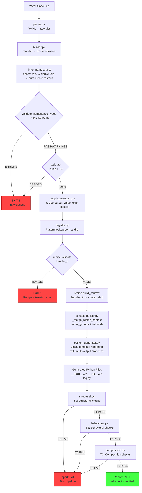
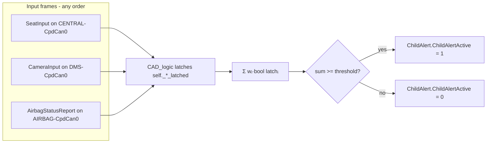

# Dataflow — Remotive Behavioral Model Compiler

> **Schema version**: `service_oriented` — namespace_types map + multi-output handlers
> **Last updated**: 2026-07-06

## End-to-End Dataflow

### Mermaid Diagram: Main Pipeline



### Mermaid Diagram: Failure Paths

```mermaid
flowchart TD
    subgraph "IR Validation Failures"
        V1[Duplicate namespace name] --> E1[Invariant violation]
        V2[Duplicate handler name] --> E1
        V3[Handler references non-existent namespace] --> E1
        V4[Output group references non-existent namespace] --> E1
        V5[Output namespace missing restbus config] --> E1
        V6[State field has multiple owners] --> E1
        V7[Periodic task missing cleanup] --> E1
        V8[Resettable state missing reset value] --> E1
        V14[Namespace ref not in namespace_types map] --> E1
        V15[Unknown type in namespace_types] --> E1
    end

    subgraph "Warnings (non-blocking)"
        W16[Orphan namespace_types key] --> WARN[Warning printed, build continues]
    end

    subgraph "Recipe Validation Failures"
        R1[Unknown pattern name] --> E2[Recipe not found in registry]
        R2[ThresholdMapping without threshold] --> E3[Recipe mismatch]
        R3[ToggleButtonState without boolean state] --> E3
        R4[WS listener without cleanup] --> E3
    end

    subgraph "Verification Failures"
        T1a[Generated file missing] --> T1F[T1 Structural FAIL]
        T1b[Syntax error in generated code] --> T1F
        T1c[Import fails] --> T1F
        T1d[Handler not async] --> T1F
        T1e[Handler missing frame param] --> T1F
        T1f[Namespace ref not found in code] --> T1F
        T1g[Output namespace lacks restbus] --> T1F

        T2a[Handler crashes with fake Frame] --> T2F[T2 Behavioral FAIL]
        T2b[restbus.update_signals not called] --> T2F
        T2c[Wrong signal values in output] --> T2F
        T2d[Toggle does not flip on second press] --> T2F
        T2e[Multi-output: wrong number of update_signals calls] --> T2F

        T3a[Duplicate handler names in model] --> T3F[T3 Composition FAIL]
        T3b[State owned by multiple handlers] --> T3F
        T3c[Pattern conflict: two handlers write same signal] --> T3F
        T3d[Periodic task without cleanup] --> T3F
        T3e[Reset handler missing for owned states] --> T3F
    end

    E1 --> EXIT1[CLI exit code 1]
    E2 --> EXIT1
    E3 --> EXIT1
    T1F --> FAIL_REPORT[VerificationReport JSON<br/>status: FAIL]
    T2F --> FAIL_REPORT
    T3F --> FAIL_REPORT
    FAIL_REPORT --> CI_BLOCK[CI blocks merge]
```



### Mermaid Diagram: Namespace Inference

```mermaid
flowchart TD
    A[spec namespace_types:<br/>SEAT-CpdCan0: can<br/>SEAT-CpdCan1: can] --> B
    B[handlers + ws_listeners] --> C{Collect refs}
    C --> D1[on_seat_occupancy.input_namespace<br/>→ SEAT-CpdCan0 as_input]
    C --> D2[on_seat_occupancy.output_groups[0]<br/>→ SEAT-CpdCan0 as_output]
    C --> D3[on_seat_occupancy.output_groups[1]<br/>→ SEAT-CpdCan1 as_output]
    D1 --> E{Derive role per name}
    D2 --> E
    D3 --> E
    E --> F1[SEAT-CpdCan0: as_input + as_output<br/>→ role=both → restbus=RestbusConfig(SEAT)]
    E --> F2[SEAT-CpdCan1: as_output only<br/>→ role=output → restbus=RestbusConfig(SEAT)]
    F1 --> G[NamespaceIR list]
    F2 --> G
```

### WeightedLogOdds runtime path (CAD)



E2E verification: `test_env/VF_child-detection/tests/test_child_detection.py` injects SEAT/DMS/AIRBAG restbus values, computes **expected** from the K-map formula, compares **actual** `HmiChildWarning.ChildAlertActive` on the live topology.

## Data Structures Flow

### YAML → Raw Spec Dict

Input (YAML — new schema):
```yaml
model:
  name: SeatECU
  ecu_name: SEAT

namespace_types:
  SEAT-CpdCan0: can
  SEAT-CpdCan1: can

handlers:
  - name: on_seat_occupancy
    pattern: ThresholdMapping
    threshold: 8
    operator: ">="
    true_when: below
    input:
      namespace: SEAT-CpdCan0
      frame_filter: SeatWeightSensor
      signal: SeatWeightSensor.WeightKg
    output:
      - namespace: SEAT-CpdCan0
        signals: [SeatInput.SeatOccupied]
      - namespace: SEAT-CpdCan1
        signals: [SeatInput.SeatOccupiedBackup]
```

Output (raw dict):
```python
{
    "model": {"name": "SeatECU", "ecu_name": "SEAT"},
    "namespace_types": {
        "SEAT-CpdCan0": "can",
        "SEAT-CpdCan1": "can"
    },
    "handlers": [
        {
            "name": "on_seat_occupancy",
            "pattern": "ThresholdMapping",
            "threshold": 8,
            "operator": ">=",
            "true_when": "below",
            "input": {
                "namespace": "SEAT-CpdCan0",
                "frame_filter": "SeatWeightSensor",
                "signal": "SeatWeightSensor.WeightKg"
            },
            "output": [
                {
                    "namespace": "SEAT-CpdCan0",
                    "signals": ["SeatInput.SeatOccupied"]
                },
                {
                    "namespace": "SEAT-CpdCan1",
                    "signals": ["SeatInput.SeatOccupiedBackup"]
                }
            ]
        }
    ]
}
```

### Raw Dict → IR Dataclasses

```python
BehavioralModelIR(
    name="SeatECU",
    ecu_name="SEAT",
    namespaces=[
        NamespaceIR(name="SEAT-CpdCan0", type="can", role="both",
                    restbus=RestbusConfigIR(sender_filter="SEAT"),
                    python_var_name="cpd_can_0"),
        NamespaceIR(name="SEAT-CpdCan1", type="can", role="output",
                    restbus=RestbusConfigIR(sender_filter="SEAT"),
                    python_var_name="cpd_can_1"),
    ],
    handlers=[
        HandlerIR(
            name="on_seat_occupancy",
            pattern="ThresholdMapping",
            input_namespace="SEAT-CpdCan0",
            input_frame_filter="SeatWeightSensor",
            input_signals=[
                InputSignalIR(name="SeatWeightSensor.WeightKg",
                             python_var_name="seat_weight_sensor_signal")
            ],
            output_groups=[
                OutputGroupIR(
                    namespace="SEAT-CpdCan0",
                    signals=[
                        OutputSignalIR(
                            name="SeatInput.SeatOccupied",
                            value_expr="1 if not (seat_weight_sensor_signal >= 8) else 0"
                        )
                    ]
                ),
                OutputGroupIR(
                    namespace="SEAT-CpdCan1",
                    signals=[
                        OutputSignalIR(
                            name="SeatInput.SeatOccupiedBackup",
                            value_expr="1 if not (seat_weight_sensor_signal >= 8) else 0"
                        )
                    ]
                ),
            ],
            threshold=8.0,
            operator=">=",
            true_when="below",
            novel_logic=False
        )
    ],
    reset_handler=None,
    novel_logic_handlers=[],
    websocket_listeners=[]
)
```

Key observations:
- **Namespaces are inferred**: `SEAT-CpdCan0` gets role `"both"` (referenced as input AND output); `SEAT-CpdCan1` gets role `"output"` (referenced only as output)
- **Restbus is auto-created**: Both get `RestbusConfigIR(sender_filter="SEAT")` because both have role `"output"` or `"both"`
- **Output is `output_groups`**: Two `OutputGroupIR` entries, one per destination namespace
- **Same value_expr fans out**: Both signals get identical `value_expr` from `ThresholdMappingRecipe.output_value_expr()`

### IR + Recipe → Template Context

```python
# ThresholdMapping recipe builds context:
{
    "name": "on_seat_occupancy",
    "pattern": "ThresholdMapping",
    "template_name": "handler_direct.py.j2",
    "handler_name": "on_seat_occupancy",
    "input_signal_var": "seat_weight_sensor_signal",
    "input_signal_ref": "SeatWeightSensor.WeightKg",
    "input_namespace_var": "cpd_can_0",
    # Canonical multi-output shape:
    "output_groups": [
        {
            "namespace": "SEAT-CpdCan0",
            "namespace_var": "cpd_can_0",
            "signals": [
                {"name": "SeatInput.SeatOccupied",
                 "value_expr": "1 if not (seat_weight_sensor_signal >= 8) else 0"}
            ]
        },
        {
            "namespace": "SEAT-CpdCan1",
            "namespace_var": "cpd_can_1",
            "signals": [
                {"name": "SeatInput.SeatOccupiedBackup",
                 "value_expr": "1 if not (seat_weight_sensor_signal >= 8) else 0"}
            ]
        }
    ],
    # Backward-compat flat fields (from output_groups[0]):
    "output_namespace": "SEAT-CpdCan0",
    "output_namespace_var": "cpd_can_0",
    "output_signals": [
        {"name": "SeatInput.SeatOccupied",
         "value_expr": "1 if not (seat_weight_sensor_signal >= 8) else 0"}
    ],
    "output_tuples": [
        ("SeatInput.SeatOccupied", "1 if not (seat_weight_sensor_signal >= 8) else 0")
    ]
}
```

### Template Context → Generated Python

Because `output_groups|length == 2`, the template takes the **multi-output branch**:

```python
import asyncio
import logging
from dataclasses import dataclass

from remotivelabs.broker import BrokerClient, Frame
from remotivelabs.topology.behavioral_model import BehavioralModel
from remotivelabs.topology.cli.behavioral_model import BehavioralModelArgs
from remotivelabs.topology.namespaces import filters
from remotivelabs.topology.namespaces.can import CanNamespace, RestbusConfig


@dataclass
class SeatECU:
    cpd_can_0: CanNamespace
    cpd_can_1: CanNamespace

    async def on_seat_occupancy(self, frame: Frame) -> None:
        seat_weight_sensor_signal = frame.signals["SeatWeightSensor.WeightKg"]
        await self.cpd_can_0.restbus.update_signals(
            ("SeatInput.SeatOccupied", 1 if not (seat_weight_sensor_signal >= 8) else 0),
        )
        await self.cpd_can_1.restbus.update_signals(
            ("SeatInput.SeatOccupiedBackup", 1 if not (seat_weight_sensor_signal >= 8) else 0),
        )


async def main(avp: BehavioralModelArgs):
    logging.info("Starting SeatECU simulator")
    async with BrokerClient(url=avp.url, auth=avp.auth) as broker_client:
        cpd_can_0 = CanNamespace(
            "SEAT-CpdCan0",
            broker_client,
            restbus_configs=[RestbusConfig([filters.SenderFilter(ecu_name="SEAT")], delay_multiplier=avp.delay_multiplier)],
        )
        cpd_can_1 = CanNamespace(
            "SEAT-CpdCan1",
            broker_client,
            restbus_configs=[RestbusConfig([filters.SenderFilter(ecu_name="SEAT")], delay_multiplier=avp.delay_multiplier)],
        )
        seatecu = SeatECU(cpd_can_0=cpd_can_0, cpd_can_1=cpd_can_1)
        async with BehavioralModel(
            "SEAT",
            namespaces=[cpd_can_0, cpd_can_1],
            broker_client=broker_client,
            input_handlers=[
                cpd_can_0.create_input_handler(
                    [filters.FrameFilter("SeatWeightSensor")],
                    seatecu.on_seat_occupancy,
                ),
            ],
        ) as bm:
            await bm.run_forever()


if __name__ == "__main__":
    args = BehavioralModelArgs.parse()
    logging.basicConfig(level=args.loglevel)
    logging.getLogger("remotivelabs.topology").setLevel(logging.DEBUG)
    asyncio.run(main(args))
```

Note the two `restbus.update_signals()` calls — one per output group, in declaration order. Both fan out the same threshold comparison expression. The `@dataclass` declares **both** `cpd_can_0` and `cpd_can_1` namespace fields.

Compare with a **single-output** handler (where `output_groups|length == 1`), which takes the else-branch and produces **byte-identical** code to the pre-service_oriented compiler:

```python
    async def on_child_alert(self, frame: Frame) -> None:
        child_alert_signal = frame.signals["ChildAlert.ChildAlertActive"]
        await self.cockpit_cpd_can_0.restbus.update_signals(
            ("HmiChildWarning.ChildAlertActive", child_alert_signal),
        )
```

## Websocket Listener Dataflow

### YAML → IR

```yaml
websocket_listeners:
  - name: camera_child_detection
    url: ws://localhost:1122
    output_namespace: DMS-CpdCan0
    signal_map:
      - ws_key: ChildDetected
        signal: CameraInput.ChildDetectedByCamera
    cleanup: true
    reconnect_delay_sec: 2.0
```

→

```python
WebsocketListenerIR(
    name="camera_child_detection",
    url="ws://localhost:1122",
    output_namespace="DMS-CpdCan0",
    signal_map=[("ChildDetected", "CameraInput.ChildDetectedByCamera")],
    cleanup=True,
    reconnect_delay_sec=2.0
)
```

### Template Context → Generated Python

The `handler_websocket.py.j2` template renders a background asyncio task:

```python
    async def _camera_child_detection_task(self) -> None:
        """Background task: external ws://localhost:1122 → CAN restbus."""
        import json, websockets
        while True:
            try:
                async with websockets.connect("ws://localhost:1122") as ws:
                    logging.info("Connected to camera_child_detection")
                    async for message in ws:
                        data = json.loads(message)
                        signals = []
                        if "ChildDetected" in data:
                            signals.append(("CameraInput.ChildDetectedByCamera", data["ChildDetected"]))
                        if signals:
                            await self.dms_cpd_can_0.restbus.update_signals(*signals)
            except Exception as e:
                logging.warning(f"camera_child_detection disconnected: {e}, reconnecting in 2.0s...")
                await asyncio.sleep(2.0)
```

The listener is started before `run_forever()` and cancelled in a `finally` block — ensuring cleanup on exit/reboot.
