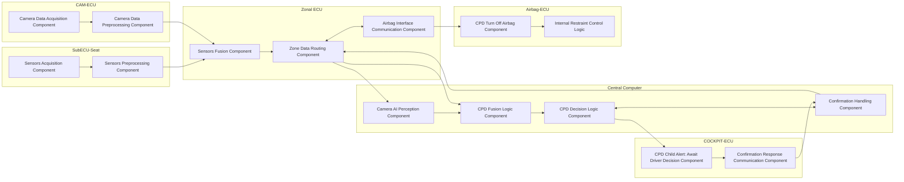

# AutonxtAI Child Presence Detection Airbag ECU - Software Components

**Document type:** Software Components Document  
**Version:** 1.0  
**Document status:** Draft  
**ID:** CHILD-SCD-001  
**Title:** Child Presence Detection High-Level Software Component Interaction Architecture

## Requirement Summary

| Field | Content |
|---|---|
| ID | CHILD-SCD-001 |
| Title | Child Presence Detection High-Level Software Component Interaction Architecture |
| Statement | This document defines the high-level software components allocated to each ECU in the Child Presence Detection (CPD) system and describes the interaction between these software components for child detection, driver confirmation handling, and airbag ECU control within the zonal SDV architecture. |

## Introduction

This document defines the high-level software component interaction architecture of the Child Presence Detection (CPD) system within a zonal Software-Defined Vehicle (SDV) architecture.

The purpose of this document is to identify the main software components allocated to each ECU involved in the CPD function and to describe the interaction between these components for child detection, driver confirmation handling, and airbag ECU control.

The document covers the high-level software architecture across the following ECUs:

- SubECU-Seat
- CAM-ECU
- Zonal ECU
- Central Computer
- COCKPIT-ECU
- Airbag-ECU

The scope of this document includes software component allocation, high-level interaction between software components, and software data flow across the involved ECUs.

Detailed software requirements, detailed signal definitions, communication message formats, and low-level software implementation are outside the scope of this document and shall be defined in the corresponding detailed software design or software requirements documents.

## ECU and Software Component Allocation

This section defines the allocation of the main software components to each ECU in the Child Presence Detection (CPD) system.

### SubECU-Seat

The following software components shall be allocated to SubECU-Seat.

#### Sensors Acquisition Component

- acquires seat weight sensor input
- acquires ISOFIX sensor input
- validates sensor availability and signal status

#### Sensors Preprocessing Component

- preprocesses sensor data
- normalizes sensor CPD inputs
- transmits seat-related CPD data to the Zonal ECU via CAN FD

### CAM-ECU

The following software components shall be allocated to CAM-ECU.

#### Camera Data Acquisition Component

- acquires image data from the passenger monitoring camera

#### Camera Data Preprocessing Component

- performs image-related preprocessing before transmission
- transmits image-related data to the Zonal ECU via CAN FD

### Zonal ECU

The following software components shall be allocated to Zonal ECU.

#### Sensors Fusion Component

- receives seat-related CPD data from SubECU-Seat
- receives image-related data from CAM-ECU

#### Zone Data Routing Component

- forwards seat-related and image-related CPD data to the Central Computer

#### Airbag Interface Communication Component

- exchanges CPD-related airbag control information with Airbag-ECU

### Central Computer

The following software components shall be allocated to the Central Computer (Jetson AGX Orin).

#### Camera AI Perception Component

- performs AI-based child detection from camera-related input

#### CPD Fusion Logic Component

- evaluates seat-related data together with camera-related results
- determines child presence status

#### CPD Decision Logic Component

- evaluates the deactivation path
- determines whether driver confirmation is required
- generates the airbag-related decision
- sends CPD status and confirmation request information to COCKPIT-ECU

#### Confirmation Handling Component

- receives and processes driver confirmation returned from COCKPIT-ECU
- sends CPD status and airbag-related decision information to the Zonal ECU

### COCKPIT-ECU

The following software components shall be allocated to COCKPIT-ECU.

#### CPD Child Alert: Await Driver Decision Component

- receives CPD-related status and confirmation request from the Central Computer
- forwards CPD status and confirmation request to the driver

#### Confirmation Response Communication Component

- receives driver confirmation input
- returns driver confirmation information to the Central Computer

### Airbag-ECU

The following software components shall be allocated to Airbag-ECU.

#### CPD Turn Off Airbag Component

- receives CPD-related airbag control information from the Zonal ECU
- applies the received CPD-related information to the restraint control logic

## Software Component Interaction Flow

This section defines the high-level interaction flow between the software components allocated across the ECUs in the Child Presence Detection (CPD) system.

| ID | Software Component | Allocated ECU | Input | Processing | Output | Connected Component |
|---:|---|---|---|---|---|---|
| 1 | Sensors Acquisition Component | SubECU-Seat | Seat weight sensor input; ISOFIX sensor input | Acquires seat-side sensor inputs; validates sensor availability and signal status | Validated seat weight sensor data; validated ISOFIX sensor data | Sensors Preprocessing Component in SubECU-Seat |
| 2 | Sensors Preprocessing Component | SubECU-Seat | Validated seat weight sensor data; validated ISOFIX sensor data | Preprocesses sensor data; normalizes seat-related CPD inputs; prepares seat-related CPD data for communication | Normalized seat-related CPD data to Zonal ECU | Sensors Fusion Component in Zonal ECU |
| 3 | Camera Data Acquisition Component | CAM-ECU | Image data from passenger monitoring camera | Acquires image data from camera | Acquired camera image data | Camera Data Preprocessing Component in CAM-ECU |
| 4 | Camera Data Preprocessing Component | CAM-ECU | Acquired camera image data | Performs image-related preprocessing; prepares image-related data for communication | Preprocessed image-related data to Zonal ECU | Sensors Fusion Component in Zonal ECU |
| 5 | Sensors Fusion Component | Zonal ECU | Seat-related CPD data from SubECU-Seat; image-related data from CAM-ECU | Receives seat-related CPD data; receives image-related data; combines received data into zonal CPD input set | Fused zonal CPD input set | Zone Data Routing Component in Zonal ECU |
| 6 | Zone Data Routing Component | Zonal ECU | Fused zonal CPD input set from Sensors Fusion Component; CPD status and airbag-related decision information from Central Computer | Forwards seat-related and image-related CPD data to Central Computer; routes CPD-related airbag control information to Airbag-ECU | Zonal CPD input data to Central Computer; CPD-related airbag control information to Airbag-ECU | Camera AI Perception Component and CPD Fusion Logic Component in Central Computer; CPD Turn Off Airbag Component in Airbag-ECU |
| 7 | Airbag Interface Communication Component | Zonal ECU | CPD-related airbag control information from Zone Data Routing Component; airbag-related interface status from Airbag-ECU | Exchanges CPD-related airbag control information with Airbag-ECU; manages airbag-related communication on zone bus | CPD-related airbag control information to Airbag-ECU; airbag-related interface status within Zonal ECU | CPD Turn Off Airbag Component in Airbag-ECU |
| 8 | Camera AI Perception Component | Central Computer | Image-related zonal CPD data from Zonal ECU | Performs AI-based child detection from camera-related input | Camera-based child detection result | CPD Fusion Logic Component in Central Computer |
| 9 | CPD Fusion Logic Component | Central Computer | Seat-related zonal CPD data from Zonal ECU; camera-based child detection result from Camera AI Perception Component | Evaluates seat-related data together with camera-related results; determines child presence status | Child presence status | CPD Decision Logic Component in Central Computer |
| 10 | CPD Decision Logic Component | Central Computer | Child presence status from CPD Fusion Logic Component; processed driver confirmation from Confirmation Handling Component | Evaluates deactivation path; determines whether driver confirmation is required; generates airbag-related decision; generates CPD status and confirmation request information | CPD status to COCKPIT-ECU; confirmation request to COCKPIT-ECU; airbag-related decision to Confirmation Handling Component | CPD Child Alert: Await Driver Decision Component in COCKPIT-ECU |
| 11 | Confirmation Handling Component | Central Computer | Driver confirmation information from COCKPIT-ECU; airbag-related decision from CPD Decision Logic Component | Receives and processes driver confirmation; finalizes CPD status and airbag-related decision information for zone communication | CPD status and airbag-related decision information to Zonal ECU | If driver does not want to turn off the airbag, close the event; otherwise continue with Zone Data Routing Component in Zonal ECU |
| 12 | CPD Child Alert: Await Driver Decision Component | COCKPIT-ECU | CPD-related status and confirmation request from Central Computer | Receives CPD-related status; receives confirmation request; forwards CPD status and confirmation request to the driver | Child detection status to driver; confirmation request to driver | Confirmation Response Communication Component in COCKPIT-ECU |
| 13 | Confirmation Response Communication Component | COCKPIT-ECU | Driver confirmation input from driver/HMI | Receives driver confirmation input; prepares confirmation response for Central Computer | Driver confirmation information to Central Computer | Confirmation Handling Component in Central Computer |
| 14 | CPD Turn Off Airbag Component | Airbag-ECU | CPD-related airbag control information from Zonal ECU | Receives CPD-related airbag control information; applies received information to restraint control logic | Restraint control input within Airbag-ECU | Internal restraint control logic in Airbag-ECU |

## Component Interaction Diagram

## Traceability

All requirements shall be traceable across the development lifecycle.

Traceability shall include:

- Link to source requirements, such as safety concept or feature specification
- Link to system architecture elements
- Link to software/hardware components
- Link to verification artifacts, such as test cases and reports

This ensures consistency, completeness, and impact analysis capability.

## Document Status and Change Management

| No. | Document Version | Author | Reviewer | Date |
|---:|---|---|---|---|
| 1 | 1.0 | Le Chi Thien |  | Apr 17, 2026 |
