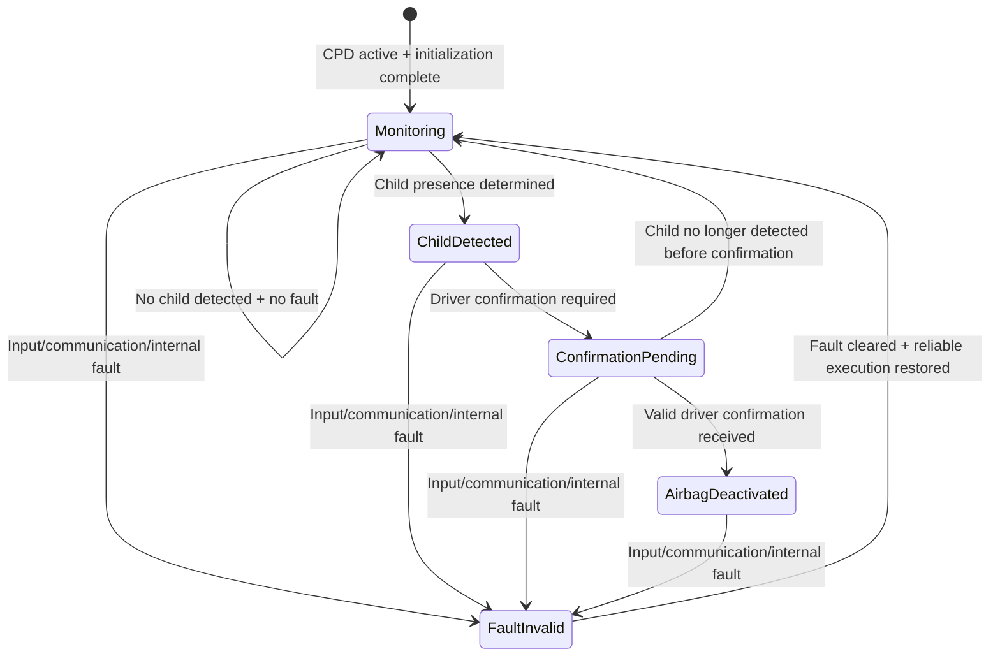
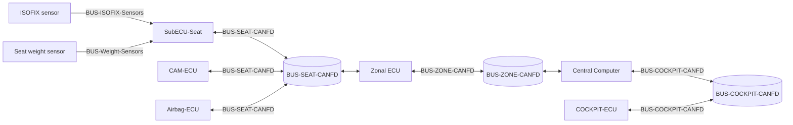
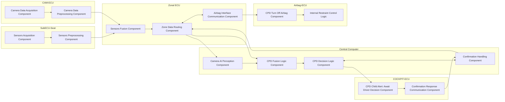

# AutonxtAI Child Presence Detection Airbag ECU - Markdown Bundle

> This combined Markdown file contains the Function Specification, Software Components, and System Requirements documents.

---

# AutonxtAI Child Presence Detection Airbag ECU - Function Specification

**Document type:** Function Specification Document  
**Version:** 1.0  
**Document status:** Draft  
**ID:** CHILD-SPEC-001  
**Title:** Child Presence Detection Main Logic Specification for Airbag ECU Control

## Requirement Summary

| Field | Content |
|---|---|
| ID | CHILD-SPEC-001 |
| Title | Child Presence Detection Main Logic Specification for Airbag ECU Control |
| Statement | The function shall detect child presence on the front passenger seat, request driver confirmation for front passenger airbag deactivation when applicable, and provide the resulting airbag control decision to the airbag ECU. |
| Condition | The Child Presence Detection function is active, the configured sensor inputs for the selected vehicle variant are available, and the child detection result is evaluated according to the defined function logic. |
| Output | Child presence status, driver confirmation request, and airbag control decision output to the airbag ECU. |

## Introduction

This document defines the main functional logic of the Child Presence Detection (CPD) feature for interaction with the front passenger airbag ECU.

The purpose of this specification is to describe how the function evaluates the available sensor inputs, determines child presence on the front passenger seat, requests driver confirmation for airbag deactivation when required, and provides the resulting airbag control decision to the airbag ECU.

The scope of this document is limited to the main function logic for child detection and airbag ECU control interaction. It includes the relevant function inputs, outputs, main decision flow, state flow, and fault-related behavior necessary to support the intended airbag control concept.

Detailed hardware design, detailed communication signal definition, AI algorithm implementation, and low-level software design are outside the scope of this document and shall be defined in the corresponding system specification or implementation documents.

## Purpose

The purpose of this specification is to define the main logic of the Child Presence Detection (CPD) function for front passenger airbag control.

This specification describes how the function:

- evaluates the available sensor inputs
- determines child presence on the front passenger seat
- requests driver confirmation for airbag deactivation when required
- provides the resulting airbag control decision to the airbag ECU

The specification is intended to support consistent function definition, implementation, and review of the CPD logic related to airbag ECU interaction.

## Inputs and Outputs

The Child Presence Detection (CPD) function uses the following inputs and outputs for main logic execution.

### Inputs

- ISOFIX sensor status
- seat weight sensor status and weight value
- passenger monitoring camera detection result
- vehicle variant configuration
- driver confirmation input from the HMI

### Input Description

- **ISOFIX sensor status** indicates whether a child seat is installed, if supported by the configured vehicle variant.
- **Seat weight sensor status and weight value** provide seat occupancy information and weight-based occupant evaluation input.
- **Passenger monitoring camera detection result** provides camera-based child classification input.
- **Vehicle variant configuration** determines which input set is available for the CPD function.
- **Driver confirmation input from the HMI** provides the driver decision for passenger airbag deactivation when confirmation is required.

### Outputs

- child presence status
- driver confirmation request
- airbag control decision to the airbag ECU
- fault status

### Output Description

- **Child presence status** indicates the result of the CPD evaluation.
- **Driver confirmation request** indicates that driver confirmation is required before front passenger airbag deactivation.
- **Airbag control decision to the airbag ECU** provides the final function output related to airbag deactivation control.
- **Fault status** indicates that the CPD function cannot operate correctly or reliably due to fault conditions.

## Main Functional Logic

The Child Presence Detection (CPD) function shall execute the following main logic for front passenger airbag ECU control.

- The function shall acquire the configured sensor inputs for the selected vehicle variant.
- The function shall evaluate the available inputs to determine child presence on the front passenger seat.
- The function shall generate a child presence status based on the evaluated input results.
- The function shall provide the child presence status to the relevant vehicle systems.
- When child presence is detected and the deactivation path is applicable, the function shall request driver confirmation via the HMI.
- The function shall wait for driver confirmation before issuing a front passenger airbag deactivation decision.
- When valid driver confirmation is received, the function shall generate the corresponding airbag control decision.
- The function shall provide the resulting airbag control decision to the airbag ECU.
- If child presence is not detected, the function shall continue normal monitoring and shall not trigger the airbag deactivation confirmation flow.
- If required inputs are unavailable, invalid, or inconsistent, the function shall inhibit airbag-related CPD output and generate a fault status.

## State Flow

The Child Presence Detection (CPD) function shall support the following main states.

### Monitoring

The function monitors the available configured sensor inputs and evaluates child presence status.

### Child Detected

The function has detected child presence on the front passenger seat based on the defined logic.

### Confirmation Pending

The function has detected child presence and is waiting for driver confirmation before issuing the airbag deactivation decision.

### Airbag Deactivated

The function has received valid driver confirmation and has issued the corresponding airbag control decision to the airbag ECU.

### Fault / Invalid

The function cannot perform reliable child presence evaluation due to missing, invalid, or inconsistent inputs, internal fault, or communication loss.

The state flow shall be defined as follows:

- The function shall enter Monitoring when the CPD function is active and required initialization is complete.
- The function shall remain in Monitoring while no child presence is detected and no fault condition is present.
- The function shall transition from Monitoring to Child Detected when child presence is determined by the defined function logic.
- The function shall transition from Child Detected to Confirmation Pending when driver confirmation is required for front passenger airbag deactivation.
- The function shall transition from Confirmation Pending to Airbag Deactivated when valid driver confirmation is received.
- The function shall transition from Confirmation Pending back to Monitoring if child presence is no longer detected before confirmation is completed.
- The function shall transition to Fault / Invalid when required inputs are unavailable, invalid, inconsistent, or when function execution cannot be completed reliably.
- The function shall inhibit airbag-related CPD output while in Fault / Invalid.
- The function shall return from Fault / Invalid to Monitoring only after the fault condition is cleared and reliable function execution is restored.

## Fault and Safety Handling

The Child Presence Detection (CPD) function shall apply the following fault and safety handling behavior.

- The function shall detect loss or invalidity of required sensor inputs used for child presence evaluation.
- The function shall detect loss of communication required for execution of the CPD function.
- The function shall detect internal faults that prevent correct execution of the CPD logic.
- The function shall generate a fault status when child presence cannot be determined reliably.
- The function shall transition to Fault / Invalid when a relevant fault condition is detected.
- The function shall inhibit airbag-related CPD output when the child presence result is unavailable, invalid, or inconsistent.
- The function shall not issue front passenger airbag deactivation when reliable child presence evaluation is not available.
- The function shall apply a defined safe reaction when a critical fault prevents correct execution of the CPD function.
- The function shall maintain or update the fault status until the fault condition is cleared.
- The function shall return to normal monitoring only after valid inputs and reliable function execution are restored.

## Module and ECU Allocation

The Child Presence Detection (CPD) function is allocated in a zonal SDV architecture with a central compute node, a seat-side sub ECU, a zonal ECU, a cockpit ECU, and a Bosch airbag ECU.

### Fixed ECU Allocation

- **Central Computer:** NVIDIA Jetson AGX Orin
- **Seat Sub ECU:** SubECU-Seat
- **Zonal ECU:** Zonal ECU
- **Cockpit ECU:** COCKPIT-ECU
- **Airbag ECU:** Bosch Airbag-ECU, based on Bosch AB premium airbag control unit family
- **CAM-ECU:** Passenger monitoring camera

The Jetson AGX Orin is used as the central computer for CPD processing and AI-based child detection. NVIDIA states the Jetson AGX Orin series delivers up to 275 TOPS and is intended for autonomous and edge AI systems, which makes it suitable as the CPD central compute platform.

The Bosch airbag ECU is fixed as the restraint-domain ECU. Bosch describes the AB premium unit as a central and scalable integration platform for software and sensor components in active and passive safety systems, which fits the airbag decision endpoint in this architecture.

### Fixed Sensor and Actuator Allocation

- **Seat weight / occupant classification sensor:** Joyson Safety Systems Integrated Foam Sensor (IFS / IFS-M)
- **ISOFIX sensor:** seat-integrated ISOFIX latch / anchor status sensor
- **Passenger airbag actuator / module:** passenger airbag module controlled by the Bosch airbag ECU

### ECU-Module Allocation

#### SubECU-Seat

- acquires seat weight sensor
- acquires ISOFIX sensor
- performs local seat-side signal acquisition and preprocessing
- communicates seat-related data to Zonal ECU

#### CAM-ECU

- acquires image data from camera
- communicates image-related data to Zonal ECU

#### Zonal ECU

- receives seat-related data from SubECU-Seat
- receives image data from CAM-ECU
- forwards CPD-related seat signals and image data into the zone bus
- communicates with the Central Computer
- communicates with Airbag-ECU where required by the architecture

#### Central Computer (Jetson AGX Orin)

- executes camera AI perception
- executes CPD main decision logic
- sends CPD status / airbag-related decision information to Zonal ECU

#### COCKPIT-ECU

- receives CPD-related status from the Central Computer
- forwards status and confirmation request to the touch-screen HMI
- returns driver confirmation to the Central Computer

#### Airbag-ECU

- receives CPD-related airbag control information
- remains the final restraint control ECU

## Communication Allocation

- Seat weight sensor -> SubECU-Seat: local sensor interface
- ISOFIX sensor -> SubECU-Seat: local sensor interface
- SubECU-Seat <-> Zonal ECU: CAN FD
- CAM-ECU <-> Zonal ECU: CAN FD
- Zonal ECU <-> Central Computer: CAN FD
- Zonal ECU <-> Airbag-ECU: CAN FD
- Central Computer <-> COCKPIT-ECU: CAN FD

## Detailed ECU Interaction Flow

This section defines the detailed interaction flow between sensors, ECUs, HMI, and the airbag ECU for the Child Presence Detection (CPD) function.

### Collecting Sensor Data Flow

- Seat weight sensor sends seat-related input to SubECU-Seat.
- ISOFIX sensor sends child seat installation-related input to SubECU-Seat.
- Camera sends image data to CAM-ECU.
- SubECU-Seat and CAM-ECU preprocess the seat-side signals and image data, then transmit the resulting CPD-related data to Zonal ECU via CAN FD.
- Zonal ECU forwards the seat-related CPD data to the Central Computer via CAN FD.

### Processing Input and Making Decision Flow

- The Central Computer performs child detection on image data, evaluates the seat-related inputs together with the camera result, and determines the child presence status.
- When child presence is detected and the deactivation path is applicable, the Central Computer sends child detection status and confirmation request information to COCKPIT-ECU via CAN FD.
- COCKPIT-ECU forwards the child detection status and confirmation request to the touch-screen HMI via Automotive Ethernet.
- The touch-screen HMI presents the child detection result and airbag deactivation confirmation request to the driver.
- The driver confirmation input is sent from the touch-screen HMI to COCKPIT-ECU via Automotive Ethernet.
- COCKPIT-ECU forwards the driver confirmation result to the Central Computer via CAN FD.
- The Central Computer evaluates the driver confirmation result and generates the resulting airbag control decision.

### Sending Control Information Flow

- The Central Computer sends the CPD-related airbag control decision to Zonal ECU via CAN FD.
- Zonal ECU forwards the CPD-related airbag control decision to Airbag-ECU via CAN FD.
- Airbag-ECU receives the final CPD-related airbag control information and applies the corresponding restraint control behavior.

### Functional Interaction Logic

- SubECU-Seat shall act as the seat-side acquisition ECU for ISOFIX sensor input and seat weight sensor input.
- Zonal ECU shall act as the zonal forwarding ECU between SubECU-Seat, Central Computer, CAM-ECU and Airbag-ECU.
- The Central Computer shall act as the main CPD logic ECU.
- COCKPIT-ECU shall act as the HMI gateway ECU for driver confirmation interaction.
- Airbag-ECU shall remain the final airbag control ECU.

## Interface and Communication Definition

This section defines the interfaces, communication paths, and bus names used by the Child Presence Detection (CPD) function.

### CPD Communication Buses

#### BUS-SEAT-CANFD

- **Protocol:** CAN FD
- **Connected nodes:** SubECU-Seat, Zonal ECU, Airbag-ECU, CAM-ECU
- **Purpose:** Transmission of seat-related CPD inputs, including weight sensor data and ISOFIX sensor data, image data, and exchange of seat-domain CPD-related information with the airbag ECU.

#### BUS-ZONE-CANFD

- **Protocol:** CAN FD
- **Connected nodes:** Zonal ECU, Central Computer
- **Purpose:** Transmission of CPD-related seat data and CPD decision-related data between the zonal ECU and the Central Computer within the zonal architecture.

#### BUS-COCKPIT-CANFD

- **Protocol:** CAN FD
- **Connected nodes:** Central Computer, COCKPIT-ECU
- **Purpose:** Transmission of child detection status and driver confirmation request / response data.

### ECU and Sensor Bus Diagram

## Traceability

All requirements shall be traceable across the development lifecycle.

Traceability shall include:

- Link to source requirements, such as safety concept or feature specification
- Link to system architecture elements
- Link to software/hardware components
- Link to verification artifacts, such as test cases and reports

This ensures consistency, completeness, and impact analysis capability.

## Document Status and Change Management

| No. | Document Version | Author | Reviewer | Date |
|---:|---|---|---|---|
| 1 | 1.0 | Le Chi Thien |  | Apr 17, 2026 |

---

# AutonxtAI Child Presence Detection Airbag ECU - Software Components

**Document type:** Software Components Document  
**Version:** 1.0  
**Document status:** Draft  
**ID:** CHILD-SCD-001  
**Title:** Child Presence Detection High-Level Software Component Interaction Architecture

## Requirement Summary

| Field | Content |
|---|---|
| ID | CHILD-SCD-001 |
| Title | Child Presence Detection High-Level Software Component Interaction Architecture |
| Statement | This document defines the high-level software components allocated to each ECU in the Child Presence Detection (CPD) system and describes the interaction between these software components for child detection, driver confirmation handling, and airbag ECU control within the zonal SDV architecture. |

## Introduction

This document defines the high-level software component interaction architecture of the Child Presence Detection (CPD) system within a zonal Software-Defined Vehicle (SDV) architecture.

The purpose of this document is to identify the main software components allocated to each ECU involved in the CPD function and to describe the interaction between these components for child detection, driver confirmation handling, and airbag ECU control.

The document covers the high-level software architecture across the following ECUs:

- SubECU-Seat
- CAM-ECU
- Zonal ECU
- Central Computer
- COCKPIT-ECU
- Airbag-ECU

The scope of this document includes software component allocation, high-level interaction between software components, and software data flow across the involved ECUs.

Detailed software requirements, detailed signal definitions, communication message formats, and low-level software implementation are outside the scope of this document and shall be defined in the corresponding detailed software design or software requirements documents.

## ECU and Software Component Allocation

This section defines the allocation of the main software components to each ECU in the Child Presence Detection (CPD) system.

### SubECU-Seat

The following software components shall be allocated to SubECU-Seat.

#### Sensors Acquisition Component

- acquires seat weight sensor input
- acquires ISOFIX sensor input
- validates sensor availability and signal status

#### Sensors Preprocessing Component

- preprocesses sensor data
- normalizes sensor CPD inputs
- transmits seat-related CPD data to the Zonal ECU via CAN FD

### CAM-ECU

The following software components shall be allocated to CAM-ECU.

#### Camera Data Acquisition Component

- acquires image data from the passenger monitoring camera

#### Camera Data Preprocessing Component

- performs image-related preprocessing before transmission
- transmits image-related data to the Zonal ECU via CAN FD

### Zonal ECU

The following software components shall be allocated to Zonal ECU.

#### Sensors Fusion Component

- receives seat-related CPD data from SubECU-Seat
- receives image-related data from CAM-ECU

#### Zone Data Routing Component

- forwards seat-related and image-related CPD data to the Central Computer

#### Airbag Interface Communication Component

- exchanges CPD-related airbag control information with Airbag-ECU

### Central Computer

The following software components shall be allocated to the Central Computer (Jetson AGX Orin).

#### Camera AI Perception Component

- performs AI-based child detection from camera-related input

#### CPD Fusion Logic Component

- evaluates seat-related data together with camera-related results
- determines child presence status

#### CPD Decision Logic Component

- evaluates the deactivation path
- determines whether driver confirmation is required
- generates the airbag-related decision
- sends CPD status and confirmation request information to COCKPIT-ECU

#### Confirmation Handling Component

- receives and processes driver confirmation returned from COCKPIT-ECU
- sends CPD status and airbag-related decision information to the Zonal ECU

### COCKPIT-ECU

The following software components shall be allocated to COCKPIT-ECU.

#### CPD Child Alert: Await Driver Decision Component

- receives CPD-related status and confirmation request from the Central Computer
- forwards CPD status and confirmation request to the driver

#### Confirmation Response Communication Component

- receives driver confirmation input
- returns driver confirmation information to the Central Computer

### Airbag-ECU

The following software components shall be allocated to Airbag-ECU.

#### CPD Turn Off Airbag Component

- receives CPD-related airbag control information from the Zonal ECU
- applies the received CPD-related information to the restraint control logic

## Software Component Interaction Flow

This section defines the high-level interaction flow between the software components allocated across the ECUs in the Child Presence Detection (CPD) system.

| ID | Software Component | Allocated ECU | Input | Processing | Output | Connected Component |
|---:|---|---|---|---|---|---|
| 1 | Sensors Acquisition Component | SubECU-Seat | Seat weight sensor input; ISOFIX sensor input | Acquires seat-side sensor inputs; validates sensor availability and signal status | Validated seat weight sensor data; validated ISOFIX sensor data | Sensors Preprocessing Component in SubECU-Seat |
| 2 | Sensors Preprocessing Component | SubECU-Seat | Validated seat weight sensor data; validated ISOFIX sensor data | Preprocesses sensor data; normalizes seat-related CPD inputs; prepares seat-related CPD data for communication | Normalized seat-related CPD data to Zonal ECU | Sensors Fusion Component in Zonal ECU |
| 3 | Camera Data Acquisition Component | CAM-ECU | Image data from passenger monitoring camera | Acquires image data from camera | Acquired camera image data | Camera Data Preprocessing Component in CAM-ECU |
| 4 | Camera Data Preprocessing Component | CAM-ECU | Acquired camera image data | Performs image-related preprocessing; prepares image-related data for communication | Preprocessed image-related data to Zonal ECU | Sensors Fusion Component in Zonal ECU |
| 5 | Sensors Fusion Component | Zonal ECU | Seat-related CPD data from SubECU-Seat; image-related data from CAM-ECU | Receives seat-related CPD data; receives image-related data; combines received data into zonal CPD input set | Fused zonal CPD input set | Zone Data Routing Component in Zonal ECU |
| 6 | Zone Data Routing Component | Zonal ECU | Fused zonal CPD input set from Sensors Fusion Component; CPD status and airbag-related decision information from Central Computer | Forwards seat-related and image-related CPD data to Central Computer; routes CPD-related airbag control information to Airbag-ECU | Zonal CPD input data to Central Computer; CPD-related airbag control information to Airbag-ECU | Camera AI Perception Component and CPD Fusion Logic Component in Central Computer; CPD Turn Off Airbag Component in Airbag-ECU |
| 7 | Airbag Interface Communication Component | Zonal ECU | CPD-related airbag control information from Zone Data Routing Component; airbag-related interface status from Airbag-ECU | Exchanges CPD-related airbag control information with Airbag-ECU; manages airbag-related communication on zone bus | CPD-related airbag control information to Airbag-ECU; airbag-related interface status within Zonal ECU | CPD Turn Off Airbag Component in Airbag-ECU |
| 8 | Camera AI Perception Component | Central Computer | Image-related zonal CPD data from Zonal ECU | Performs AI-based child detection from camera-related input | Camera-based child detection result | CPD Fusion Logic Component in Central Computer |
| 9 | CPD Fusion Logic Component | Central Computer | Seat-related zonal CPD data from Zonal ECU; camera-based child detection result from Camera AI Perception Component | Evaluates seat-related data together with camera-related results; determines child presence status | Child presence status | CPD Decision Logic Component in Central Computer |
| 10 | CPD Decision Logic Component | Central Computer | Child presence status from CPD Fusion Logic Component; processed driver confirmation from Confirmation Handling Component | Evaluates deactivation path; determines whether driver confirmation is required; generates airbag-related decision; generates CPD status and confirmation request information | CPD status to COCKPIT-ECU; confirmation request to COCKPIT-ECU; airbag-related decision to Confirmation Handling Component | CPD Child Alert: Await Driver Decision Component in COCKPIT-ECU |
| 11 | Confirmation Handling Component | Central Computer | Driver confirmation information from COCKPIT-ECU; airbag-related decision from CPD Decision Logic Component | Receives and processes driver confirmation; finalizes CPD status and airbag-related decision information for zone communication | CPD status and airbag-related decision information to Zonal ECU | If driver does not want to turn off the airbag, close the event; otherwise continue with Zone Data Routing Component in Zonal ECU |
| 12 | CPD Child Alert: Await Driver Decision Component | COCKPIT-ECU | CPD-related status and confirmation request from Central Computer | Receives CPD-related status; receives confirmation request; forwards CPD status and confirmation request to the driver | Child detection status to driver; confirmation request to driver | Confirmation Response Communication Component in COCKPIT-ECU |
| 13 | Confirmation Response Communication Component | COCKPIT-ECU | Driver confirmation input from driver/HMI | Receives driver confirmation input; prepares confirmation response for Central Computer | Driver confirmation information to Central Computer | Confirmation Handling Component in Central Computer |
| 14 | CPD Turn Off Airbag Component | Airbag-ECU | CPD-related airbag control information from Zonal ECU | Receives CPD-related airbag control information; applies received information to restraint control logic | Restraint control input within Airbag-ECU | Internal restraint control logic in Airbag-ECU |

## Component Interaction Diagram

## Traceability

All requirements shall be traceable across the development lifecycle.

Traceability shall include:

- Link to source requirements, such as safety concept or feature specification
- Link to system architecture elements
- Link to software/hardware components
- Link to verification artifacts, such as test cases and reports

This ensures consistency, completeness, and impact analysis capability.

## Document Status and Change Management

| No. | Document Version | Author | Reviewer | Date |
|---:|---|---|---|---|
| 1 | 1.0 | Le Chi Thien |  | Apr 17, 2026 |

---

# AutonxtAI Child Presence Detection Airbag ECU - System Requirements

**Document type:** System Requirements Document  
**Version:** 1.0  
**Document status:** Draft  
**ID:** SYS-REQ-001  
**Title:** Child Presence Detection to Navigate Airbag ECU

## Requirement Summary

| Field | Content |
|---|---|
| ID | SYS-REQ-001 |
| Title | Child Presence Detection to Navigate Airbag ECU |
| Statement | The system shall detect the presence of a child seated in a child seat installed on the front passenger seat and deactivate the airbag based on driver decision. |
| Rationale | Prevent unsafe passenger airbag deployment. |
| Source | Autonxt AI - Safety concept |
| Verification | Test + analysis |
| Acceptance criteria | Airbag suppression status shall be transmitted to the airbag ECUs within 100 ms after confirmation of driver when child presenting. |

## Introduction

The purpose of this document is to define the system-level requirements for the Child Presence Detection (CPD) feature in the vehicle.

This document provides a structured and traceable specification of the expected system behavior, including functional and non-functional requirements, system interactions, and verification criteria. It serves as a reference for system design, implementation, integration, and validation activities.

The CPD feature supports multiple vehicle variants with different sensor configurations. The requirements defined in this document ensure consistent functional behavior across all supported variants while allowing configuration-specific capabilities.

## Scope

This document covers the requirements for detecting the presence of a child seated in a child seat installed on the front passenger seat and supporting the decision to suppress the passenger airbag when required.

The CPD feature is implemented across multiple vehicle variants with different sensor configurations.

### EV Basic Variant

- ISOFIX sensor
- Seat weight sensor

### EV Premium Variant

- Seat weight sensor
- Passenger monitoring camera (AI-based detection)

### EV Luxury Variant

- ISOFIX sensor
- Seat weight sensor
- Passenger monitoring camera (AI-based detection)

Despite differences in sensor configurations, all variants shall achieve the same functional objective of reliably detecting child presence and supporting safe airbag control.

### In Scope

- Detection of child presence using available sensor configurations
- Evaluation and confirmation of detection results
- Communication of detection status to the restraint system
- Interaction with driver input where applicable

### Out of Scope

- Detailed algorithm design, such as AI model implementation
- Hardware design of sensors and ECUs
- Low-level software implementation details

## References

The following documents are referenced and may contain additional requirements or constraints applicable to this specification:

- Child Detection Function Requirement from Kaizenics

## Terms, Definitions, and Abbreviations

| Term | Definition |
|---|---|
| CPD | Child Presence Detection |
| HMI | Human Monitoring Interface |

## System Context

The Child Presence Detection (CPD) system is part of the vehicle occupant monitoring and safety system.

The system:

- receives input from weight sensors and, where available, the passenger monitoring camera
- evaluates the available sensor information to determine child presence status
- transmits the detection result to the central computer unit to decide whether sending ignition signal to airbag ECUs
- may receive driver-related input where required by the vehicle concept

The CPD function supports multiple vehicle variants with different sensor availability. Depending on the variant, the function may use ISOFIX-related sensing, seat weight sensing, and camera-based occupant detection.

Within a zonal vehicle architecture, sensor data may be acquired by distributed zonal controllers and processed by a central compute unit. The resulting child presence status is provided to the airbag ECUs for passenger airbag control.

## Assumptions and Constraints

### Assumptions

- The CPD function is applicable to the front passenger seat.
- Required input signals are available according to the configured vehicle variant.
- The airbag ECUs interface is available.
- Driver confirmation input is available through the HMI.
- Variant coding is available to identify the implemented sensor configuration.

### Constraints

- The CPD function behavior depends on the sensor set available in the respective vehicle variant.
- The CPD function shall provide its output via the defined vehicle interface to the airbag ECUs.
- The CPD function shall support user confirmation as a mandatory condition for passenger airbag activation or deactivation.
- The CPD function shall comply with the applicable safety concept and legal requirements.
- Detailed sensor design and detailed detection algorithm design are outside the scope of this document.

## Functional Requirements

This section defines the functional behavior of the system.

Functional requirements describe what the system shall do, including:

- The system shall detect child presence on the front passenger seat.
- The system shall provide child presence status to the airbag ECUs.
- The system shall require driver confirmation before deactivating the front passenger airbag when child presence is detected.
- The system shall deactivate the front passenger airbag when child presence is detected and the driver confirms deactivation.

## Non-Functional Requirements

Non-functional requirements define constraints on system performance and quality attributes.

This includes:

- The system shall provide the required CPD output within 100 ms under defined operating conditions.
- The system shall achieve a child presence detection accuracy of at least 98% under defined operating conditions.
- The passenger monitoring camera shall provide coverage of the front passenger seat area, including the child seat space.
- The system shall detect loss or invalidity of required sensor inputs used for the CPD function.
- The system shall detect loss of communication required for the CPD function.
- The system shall report a fault status when the CPD function cannot operate as intended due to internal fault, sensor fault, or communication loss.
- The system shall enter a defined safe state when child presence detection cannot be performed reliably.

## Interface Requirements

This section defines the interfaces between the Child Presence Detection (CPD) system and related vehicle systems.

The CPD system shall interface with:

- Seat weight sensor
- ISOFIX sensor
- Passenger monitoring camera
- Airbag ECUs
- Touch-screen HMI

The interface communication shall be defined as follows:

- CAN shall be used for communication between the central computer, zonal ECU, airbag ECUs, cockpit ECU, seat weight sensor, and ISOFIX sensor.
- Ethernet shall be used for communication between the cockpit ECU and the touch-screen HMI.
- An automotive camera interface shall be used for communication between the passenger monitoring camera and the central computer.

The CPD system shall support the following interface interactions:

- The seat weight sensor and ISOFIX sensor shall provide input to the central computer through the zonal ECU.
- The passenger monitoring camera shall provide image data directly to the central computer for AI-based processing.
- The CPD system shall provide child detection status and confirmation request information to the cockpit system.
- The touch-screen HMI shall display child detection status and airbag confirmation request information to the driver.
- Driver confirmation input shall be provided from the touch-screen HMI via the cockpit system to the CPD system.
- The CPD system shall send the deactivation signal to airbag ECUs if receiving confirmation from driver.

The CPD-related interfaces shall define:

- signal availability
- data flow direction
- timing constraints
- logical interaction between connected systems

## Operating Modes and States

This section defines the operating modes and states relevant to the Child Presence Detection (CPD) system.

The CPD system shall support the following operating modes:

- Initialization
- Normal Operation
- Confirmation Pending
- Airbag Deactivation Active
- Fault / Degraded Operation

The operating modes shall be defined as follows:

### Initialization

The system starts up and checks the availability of required inputs and interfaces.

### Normal Operation

The system evaluates the available sensor inputs and determines the child presence status.

### Confirmation Pending

The system has detected child presence and is waiting for driver confirmation before deactivating the front passenger airbag.

### Airbag Deactivation Active

The system has received driver confirmation and has issued the corresponding deactivation status to the restraint controller.

### Fault / Degraded Operation

The system detects internal fault, sensor fault, or communication loss and cannot perform the CPD function as intended.

### State-Related Requirements

The CPD system behavior shall comply with the following state-related requirements:

- The system shall complete initialization before providing CPD output for airbag control.
- The system shall enter Normal Operation after successful initialization.
- The system shall enter Confirmation Pending when child presence is detected and airbag deactivation requires driver confirmation.
- The system shall enter Airbag Deactivation Active only after driver confirmation is received.
- The system shall not deactivate the front passenger airbag while the system is in Confirmation Pending.
- The system shall enter Fault / Degraded Operation when required inputs or communications are unavailable or invalid.
- The system shall provide the appropriate status output according to the active operating mode.
- The system shall transition to a defined safe state when the CPD function cannot be performed reliably.

## Fault Handling and Diagnostic Requirements

This section defines the fault handling and diagnostic requirements of the Child Presence Detection (CPD) system.

The CPD system shall support detection of the following fault conditions:

- loss of seat weight sensor input
- loss of ISOFIX sensor input
- loss of passenger monitoring camera input
- internal processing fault
- loss of communication required for the CPD function

The CPD system shall fulfill the following fault handling requirements:

- The system shall detect loss or invalidity of required sensor inputs used for the CPD function.
- The system shall detect loss of communication required for the CPD function.
- The system shall detect internal faults that prevent correct execution of the CPD function.
- The system shall report a fault status when the CPD function cannot operate as intended.
- The system shall transition to Fault / Degraded Operation when a relevant fault is detected.
- The system shall inhibit child presence detection output for airbag control when the CPD function cannot be performed reliably.
- The system shall maintain or transition to a defined safe state when a critical fault is detected.
- The system shall make diagnostic status available through the defined system interface.
- The system shall clear or update the reported fault status when the fault condition is no longer present, according to the defined diagnostic concept.

## Safety Requirements

This section defines the safety requirements of the Child Presence Detection (CPD) system.

The CPD system shall fulfill the following safety requirements:

- The system shall support safe passenger airbag control based on child presence detection status.
- The system shall require driver confirmation before deactivating the front passenger airbag when child presence is detected.
- The system shall not deactivate the front passenger airbag without driver confirmation when child presence is detected.
- The system shall provide child presence status to the driver only when the required inputs are available and valid.
- The system shall inhibit CPD output for airbag control when child presence detection cannot be performed reliably.
- The system shall transition to a defined safe state when a critical fault prevents correct execution of the CPD function.
- The system shall report a fault status when the CPD function cannot support the intended airbag-related function.
- The system shall ensure that invalid, unavailable, or inconsistent input data does not lead to unintended airbag deactivation.
- The system shall maintain traceable linkage between child presence detection status, driver confirmation, and airbag control output.

## Verification Strategy

This section defines the verification strategy for the Child Presence Detection (CPD) system requirements.

Each requirement defined in this document shall be verifiable by one or more of the following methods:

- Test
- Analysis
- Inspection
- Simulation

The verification strategy shall follow the principles below:

- Functional requirements shall be verified primarily by system test and integration test.
- Non-functional requirements shall be verified by test, analysis, or measurement, depending on the requirement type.
- Interface requirements shall be verified by inspection, interface test, and integration test.
- Operating modes and state transitions shall be verified by system test and state transition test.
- Fault handling and diagnostic requirements shall be verified by fault injection test, communication loss test, and diagnostic evaluation.
- Safety requirements shall be verified by test and analysis in accordance with the system safety concept.

Each requirement shall define or be associated with:

- a verification method
- corresponding acceptance criteria

## Traceability

All requirements shall be traceable across the development lifecycle.

Traceability shall include:

- Link to source requirements, such as safety concept or feature specification
- Link to system architecture elements
- Link to software/hardware components
- Link to verification artifacts, such as test cases and reports

This ensures consistency, completeness, and impact analysis capability.

## Document Status and Change Management

| No. | Document Version | Author | Reviewer | Date |
|---:|---|---|---|---|
| 1 | 1.0 | Le Chi Thien |  | Apr 17, 2026 |
