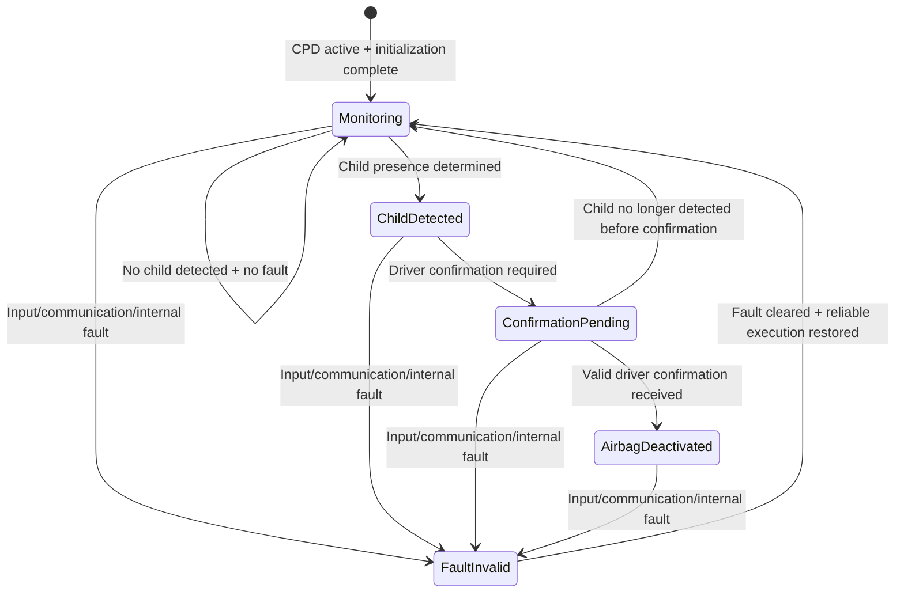
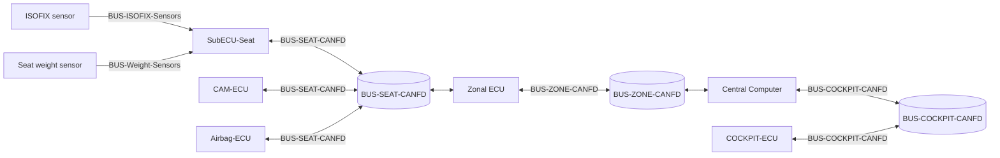

# AutonxtAI Child Presence Detection Airbag ECU - Function Specification

**Document type:** Function Specification Document  
**Version:** 1.0  
**Document status:** Draft  
**ID:** CHILD-SPEC-001  
**Title:** Child Presence Detection Main Logic Specification for Airbag ECU Control

## Requirement Summary

| Field | Content |
|---|---|
| ID | CHILD-SPEC-001 |
| Title | Child Presence Detection Main Logic Specification for Airbag ECU Control |
| Statement | The function shall detect child presence on the front passenger seat, request driver confirmation for front passenger airbag deactivation when applicable, and provide the resulting airbag control decision to the airbag ECU. |
| Condition | The Child Presence Detection function is active, the configured sensor inputs for the selected vehicle variant are available, and the child detection result is evaluated according to the defined function logic. |
| Output | Child presence status, driver confirmation request, and airbag control decision output to the airbag ECU. |

## Introduction

This document defines the main functional logic of the Child Presence Detection (CPD) feature for interaction with the front passenger airbag ECU.

The purpose of this specification is to describe how the function evaluates the available sensor inputs, determines child presence on the front passenger seat, requests driver confirmation for airbag deactivation when required, and provides the resulting airbag control decision to the airbag ECU.

The scope of this document is limited to the main function logic for child detection and airbag ECU control interaction. It includes the relevant function inputs, outputs, main decision flow, state flow, and fault-related behavior necessary to support the intended airbag control concept.

Detailed hardware design, detailed communication signal definition, AI algorithm implementation, and low-level software design are outside the scope of this document and shall be defined in the corresponding system specification or implementation documents.

## Purpose

The purpose of this specification is to define the main logic of the Child Presence Detection (CPD) function for front passenger airbag control.

This specification describes how the function:

- evaluates the available sensor inputs
- determines child presence on the front passenger seat
- requests driver confirmation for airbag deactivation when required
- provides the resulting airbag control decision to the airbag ECU

The specification is intended to support consistent function definition, implementation, and review of the CPD logic related to airbag ECU interaction.

## Inputs and Outputs

The Child Presence Detection (CPD) function uses the following inputs and outputs for main logic execution.

### Inputs

- ISOFIX sensor status
- seat weight sensor status and weight value
- passenger monitoring camera detection result
- vehicle variant configuration
- driver confirmation input from the HMI

### Input Description

- **ISOFIX sensor status** indicates whether a child seat is installed, if supported by the configured vehicle variant.
- **Seat weight sensor status and weight value** provide seat occupancy information and weight-based occupant evaluation input.
- **Passenger monitoring camera detection result** provides camera-based child classification input.
- **Vehicle variant configuration** determines which input set is available for the CPD function.
- **Driver confirmation input from the HMI** provides the driver decision for passenger airbag deactivation when confirmation is required.

### Outputs

- child presence status
- driver confirmation request
- airbag control decision to the airbag ECU
- fault status

### Output Description

- **Child presence status** indicates the result of the CPD evaluation.
- **Driver confirmation request** indicates that driver confirmation is required before front passenger airbag deactivation.
- **Airbag control decision to the airbag ECU** provides the final function output related to airbag deactivation control.
- **Fault status** indicates that the CPD function cannot operate correctly or reliably due to fault conditions.

## Main Functional Logic

The Child Presence Detection (CPD) function shall execute the following main logic for front passenger airbag ECU control.

- The function shall acquire the configured sensor inputs for the selected vehicle variant.
- The function shall evaluate the available inputs to determine child presence on the front passenger seat.
- The function shall generate a child presence status based on the evaluated input results.
- The function shall provide the child presence status to the relevant vehicle systems.
- When child presence is detected and the deactivation path is applicable, the function shall request driver confirmation via the HMI.
- The function shall wait for driver confirmation before issuing a front passenger airbag deactivation decision.
- When valid driver confirmation is received, the function shall generate the corresponding airbag control decision.
- The function shall provide the resulting airbag control decision to the airbag ECU.
- If child presence is not detected, the function shall continue normal monitoring and shall not trigger the airbag deactivation confirmation flow.
- If required inputs are unavailable, invalid, or inconsistent, the function shall inhibit airbag-related CPD output and generate a fault status.

## State Flow

The Child Presence Detection (CPD) function shall support the following main states.

### Monitoring

The function monitors the available configured sensor inputs and evaluates child presence status.

### Child Detected

The function has detected child presence on the front passenger seat based on the defined logic.

### Confirmation Pending

The function has detected child presence and is waiting for driver confirmation before issuing the airbag deactivation decision.

### Airbag Deactivated

The function has received valid driver confirmation and has issued the corresponding airbag control decision to the airbag ECU.

### Fault / Invalid

The function cannot perform reliable child presence evaluation due to missing, invalid, or inconsistent inputs, internal fault, or communication loss.

The state flow shall be defined as follows:

- The function shall enter Monitoring when the CPD function is active and required initialization is complete.
- The function shall remain in Monitoring while no child presence is detected and no fault condition is present.
- The function shall transition from Monitoring to Child Detected when child presence is determined by the defined function logic.
- The function shall transition from Child Detected to Confirmation Pending when driver confirmation is required for front passenger airbag deactivation.
- The function shall transition from Confirmation Pending to Airbag Deactivated when valid driver confirmation is received.
- The function shall transition from Confirmation Pending back to Monitoring if child presence is no longer detected before confirmation is completed.
- The function shall transition to Fault / Invalid when required inputs are unavailable, invalid, inconsistent, or when function execution cannot be completed reliably.
- The function shall inhibit airbag-related CPD output while in Fault / Invalid.
- The function shall return from Fault / Invalid to Monitoring only after the fault condition is cleared and reliable function execution is restored.

## Fault and Safety Handling

The Child Presence Detection (CPD) function shall apply the following fault and safety handling behavior.

- The function shall detect loss or invalidity of required sensor inputs used for child presence evaluation.
- The function shall detect loss of communication required for execution of the CPD function.
- The function shall detect internal faults that prevent correct execution of the CPD logic.
- The function shall generate a fault status when child presence cannot be determined reliably.
- The function shall transition to Fault / Invalid when a relevant fault condition is detected.
- The function shall inhibit airbag-related CPD output when the child presence result is unavailable, invalid, or inconsistent.
- The function shall not issue front passenger airbag deactivation when reliable child presence evaluation is not available.
- The function shall apply a defined safe reaction when a critical fault prevents correct execution of the CPD function.
- The function shall maintain or update the fault status until the fault condition is cleared.
- The function shall return to normal monitoring only after valid inputs and reliable function execution are restored.

## Module and ECU Allocation

The Child Presence Detection (CPD) function is allocated in a zonal SDV architecture with a central compute node, a seat-side sub ECU, a zonal ECU, a cockpit ECU, and a Bosch airbag ECU.

### Fixed ECU Allocation

- **Central Computer:** NVIDIA Jetson AGX Orin
- **Seat Sub ECU:** SubECU-Seat
- **Zonal ECU:** Zonal ECU
- **Cockpit ECU:** COCKPIT-ECU
- **Airbag ECU:** Bosch Airbag-ECU, based on Bosch AB premium airbag control unit family
- **CAM-ECU:** Passenger monitoring camera

The Jetson AGX Orin is used as the central computer for CPD processing and AI-based child detection. NVIDIA states the Jetson AGX Orin series delivers up to 275 TOPS and is intended for autonomous and edge AI systems, which makes it suitable as the CPD central compute platform.

The Bosch airbag ECU is fixed as the restraint-domain ECU. Bosch describes the AB premium unit as a central and scalable integration platform for software and sensor components in active and passive safety systems, which fits the airbag decision endpoint in this architecture.

### Fixed Sensor and Actuator Allocation

- **Seat weight / occupant classification sensor:** Joyson Safety Systems Integrated Foam Sensor (IFS / IFS-M)
- **ISOFIX sensor:** seat-integrated ISOFIX latch / anchor status sensor
- **Passenger airbag actuator / module:** passenger airbag module controlled by the Bosch airbag ECU

### ECU-Module Allocation

#### SubECU-Seat

- acquires seat weight sensor
- acquires ISOFIX sensor
- performs local seat-side signal acquisition and preprocessing
- communicates seat-related data to Zonal ECU

#### CAM-ECU

- acquires image data from camera
- communicates image-related data to Zonal ECU

#### Zonal ECU

- receives seat-related data from SubECU-Seat
- receives image data from CAM-ECU
- forwards CPD-related seat signals and image data into the zone bus
- communicates with the Central Computer
- communicates with Airbag-ECU where required by the architecture

#### Central Computer (Jetson AGX Orin)

- executes camera AI perception
- executes CPD main decision logic
- sends CPD status / airbag-related decision information to Zonal ECU

#### COCKPIT-ECU

- receives CPD-related status from the Central Computer
- forwards status and confirmation request to the touch-screen HMI
- returns driver confirmation to the Central Computer

#### Airbag-ECU

- receives CPD-related airbag control information
- remains the final restraint control ECU

## Communication Allocation

- Seat weight sensor -> SubECU-Seat: local sensor interface
- ISOFIX sensor -> SubECU-Seat: local sensor interface
- SubECU-Seat <-> Zonal ECU: CAN FD
- CAM-ECU <-> Zonal ECU: CAN FD
- Zonal ECU <-> Central Computer: CAN FD
- Zonal ECU <-> Airbag-ECU: CAN FD
- Central Computer <-> COCKPIT-ECU: CAN FD

## Detailed ECU Interaction Flow

This section defines the detailed interaction flow between sensors, ECUs, HMI, and the airbag ECU for the Child Presence Detection (CPD) function.

### Collecting Sensor Data Flow

- Seat weight sensor sends seat-related input to SubECU-Seat.
- ISOFIX sensor sends child seat installation-related input to SubECU-Seat.
- Camera sends image data to CAM-ECU.
- SubECU-Seat and CAM-ECU preprocess the seat-side signals and image data, then transmit the resulting CPD-related data to Zonal ECU via CAN FD.
- Zonal ECU forwards the seat-related CPD data to the Central Computer via CAN FD.

### Processing Input and Making Decision Flow

- The Central Computer performs child detection on image data, evaluates the seat-related inputs together with the camera result, and determines the child presence status.
- When child presence is detected and the deactivation path is applicable, the Central Computer sends child detection status and confirmation request information to COCKPIT-ECU via CAN FD.
- COCKPIT-ECU forwards the child detection status and confirmation request to the touch-screen HMI via Automotive Ethernet.
- The touch-screen HMI presents the child detection result and airbag deactivation confirmation request to the driver.
- The driver confirmation input is sent from the touch-screen HMI to COCKPIT-ECU via Automotive Ethernet.
- COCKPIT-ECU forwards the driver confirmation result to the Central Computer via CAN FD.
- The Central Computer evaluates the driver confirmation result and generates the resulting airbag control decision.

### Sending Control Information Flow

- The Central Computer sends the CPD-related airbag control decision to Zonal ECU via CAN FD.
- Zonal ECU forwards the CPD-related airbag control decision to Airbag-ECU via CAN FD.
- Airbag-ECU receives the final CPD-related airbag control information and applies the corresponding restraint control behavior.

### Functional Interaction Logic

- SubECU-Seat shall act as the seat-side acquisition ECU for ISOFIX sensor input and seat weight sensor input.
- Zonal ECU shall act as the zonal forwarding ECU between SubECU-Seat, Central Computer, CAM-ECU and Airbag-ECU.
- The Central Computer shall act as the main CPD logic ECU.
- COCKPIT-ECU shall act as the HMI gateway ECU for driver confirmation interaction.
- Airbag-ECU shall remain the final airbag control ECU.

## Interface and Communication Definition

This section defines the interfaces, communication paths, and bus names used by the Child Presence Detection (CPD) function.

### CPD Communication Buses

#### BUS-SEAT-CANFD

- **Protocol:** CAN FD
- **Connected nodes:** SubECU-Seat, Zonal ECU, Airbag-ECU, CAM-ECU
- **Purpose:** Transmission of seat-related CPD inputs, including weight sensor data and ISOFIX sensor data, image data, and exchange of seat-domain CPD-related information with the airbag ECU.

#### BUS-ZONE-CANFD

- **Protocol:** CAN FD
- **Connected nodes:** Zonal ECU, Central Computer
- **Purpose:** Transmission of CPD-related seat data and CPD decision-related data between the zonal ECU and the Central Computer within the zonal architecture.

#### BUS-COCKPIT-CANFD

- **Protocol:** CAN FD
- **Connected nodes:** Central Computer, COCKPIT-ECU
- **Purpose:** Transmission of child detection status and driver confirmation request / response data.

### ECU and Sensor Bus Diagram

## Traceability

All requirements shall be traceable across the development lifecycle.

Traceability shall include:

- Link to source requirements, such as safety concept or feature specification
- Link to system architecture elements
- Link to software/hardware components
- Link to verification artifacts, such as test cases and reports

This ensures consistency, completeness, and impact analysis capability.

## Document Status and Change Management

| No. | Document Version | Author | Reviewer | Date |
|---:|---|---|---|---|
| 1 | 1.0 | Le Chi Thien |  | Apr 17, 2026 |
