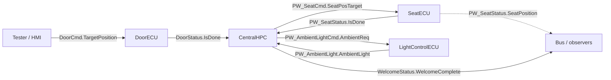

# Passenger Welcome — ECA generator workspace

Working tree for the **new** bmgen front-end that consumes `schema_Nhan`-style ECU YAML
and emits Remotive Behavioral Model Python.

## Scenario: Passenger Welcome

Full signal map (draw.io + SVG):

- [`passenger_welcome_signal_map.drawio`](./passenger_welcome_signal_map.drawio)
- [`passenger_welcome_signal_map.svg`](./passenger_welcome_signal_map.svg)



| ECU | Role |
|-----|------|
| **DoorECU** | RX target position → step motion → TX CurrentPosition / IsMoving / IsDone |
| **CentralHPC** | On Door IsDone false→true → fan-out seat + ambient → join both → TX WelcomeComplete |
| **SeatECU** | RX SeatPosTarget → startup + step → TX SeatPosition / IsDone |
| **LightControlECU** | RX AmbientReq → 1:1 mirror TX AmbientLight |

## Layout

```text
passenger_welcome_eca/
  README.md
  schema/                 # schema_Nhan dialect reference (symlink or copy)
  examples/               # 4 ECU YAML for this scenario
    SPECS.md              # per-ECU behavior spec
    door_ecu.yaml
    central_hpc.yaml
    seat_ecu.yaml
    light_control_ecu.yaml
```

Per-ECU specs (interfaces, params, state, timers, rules, acceptance):
[`examples/SPECS.md`](./examples/SPECS.md).

## Dialect

See repo root [`docs/schema_Nhan.yaml`](../../docs/schema_Nhan.yaml) and behavior spec
[`docs/schema_Nhan_bmgen_behavior.md`](../../docs/schema_Nhan_bmgen_behavior.md).

Signal names use `Frame.Signal` so a future Remotive binding can map FrameFilter cleanly.
Cross-ECU coordination is **signal-level only** (no topology file in this workspace yet).

## Signal map (live schema_v2 / Remotive)

| From → To | Signal | Meaning |
|-----------|--------|---------|
| Tester → DoorECU | `DoorCmd.TargetPosition` | commanded door position 0..100 |
| DoorECU → CentralHPC / bus | `DoorStatus.CurrentPosition` / `IsMoving` / `IsDone` | level motion status (`IsDone` = arrived) |
| CentralHPC → SeatECU | `PW_SeatCmd.SeatPosTarget` | welcome seat target (param `5`) |
| SeatECU → CentralHPC / bus | `PW_SeatStatus.SeatPosition` / `IsDone` | seat motion + done |
| CentralHPC → LightControlECU | `PW_AmbientLightCmd.AmbientReq` | welcome ambient (param `1`) |
| LightControlECU → CentralHPC / bus | `PW_AmbientLight.AmbientLight` | mirrored ambient value |
| CentralHPC → bus | `WelcomeStatus.WelcomeComplete` | join complete (level `1`; sticky MVP) |

Abstract SPECS dialect (`DoorOpenRequest` / fade timers) lives only in [`examples/SPECS.md`](./examples/SPECS.md) — **not** what `examples/*.yaml` or live E2E use.

## Schema gap used as pattern

`actions` only allow `tx | set_state` — no `start_timer`. Actuator ECUs therefore use
`timers.auto_start: true` and gate completion rules with state (`$door_opening`,
`$adjusting`, `$lighting`). First tick after request latches complete (interval ≈ sequence duration).

## Live E2E (Remotive)

Four example YAMLs generate pure bmgen-eca models and run together on a dedicated
topology (does **not** modify `getting_started`):

`test_env/remotivelabs-topology-examples/passenger_welcome/`

```bash
# schema_v2 examples → generate ×4 → pure-copy → topology → pytest golden path
bash test_env/remotivelabs-topology-examples/passenger_welcome/scripts/run_passenger_welcome_ui.sh test-only all
```

Golden path: Door `TargetPosition=100` → Central edge on `DoorStatus.IsDone` →
fan-out seat target `5` + ambient `1` → join → `WelcomeStatus.WelcomeComplete=1`.

Buses (zero-patch `CanNamespace`): `DoorECU-BodyCan0`, `SeatECU-BodyCan0`,
`LightControlECU-BodyCan0`, `CentralHPC-BodyCan0` on one physical `BodyCan0`.

Compiler package: monorepo `bmgen_ECA/` (`python -m bmgen_eca generate …`).
