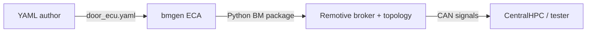
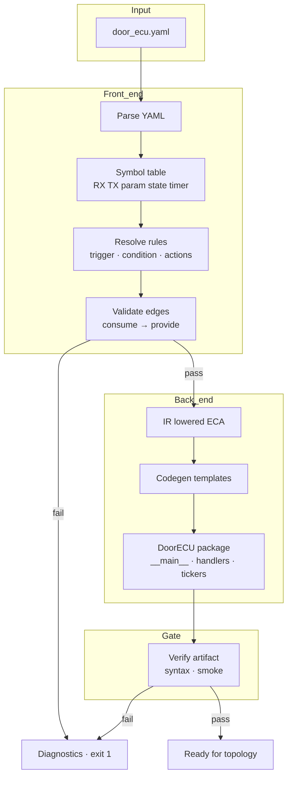
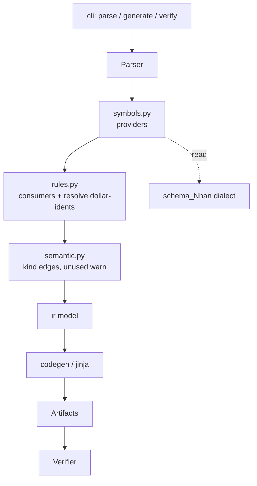
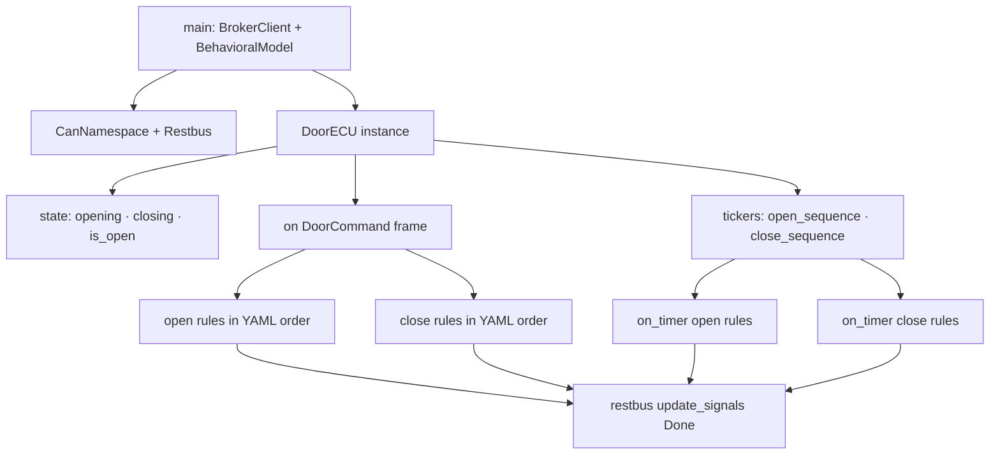

# Generator × DoorECU — business behavior + architecture

Input đã accept: [`door_ecu.yaml`](./door_ecu.yaml).

---

## Phần A — Business behavior (product)

### A1. Generator làm gì cho team?

Người viết YAML mô tả **cửa ảo** (mở/đóng, delay, ack).  
Generator biến file đó thành **code ECU mock** chạy trên Remotive: nghe lệnh trên bus, giữ trạng thái cửa, sau đúng “thời gian cơ khí” báo done.

Không cần hand-code Python BM cho DoorECU mỗi lần đổi logic.

### A2. Hành vi business của DoorECU (spec đã accept)

| Tình huống | Kết quả business |
|------------|------------------|
| Cửa đóng + lệnh mở | ~1.5s sau → báo **mở xong** |
| Cửa đã mở + lệnh mở | báo **mở xong ngay** (ack) |
| Cửa mở + lệnh đóng | ~1.5s sau → báo **đóng xong**, cửa = đóng |
| Cửa đã đóng + lệnh đóng | báo **đóng xong ngay** |
| Đang mở / đang đóng | lệnh xung đột **bị bỏ** |
| Lệnh không hợp lệ (≠ 1) | **bỏ** |

Chuỗi business: **đóng → mở (1.5s) → (ack nếu mở lại) → đóng (1.5s) → mở lại (1.5s)**.

### A3. Generator phải **đảm bảo** (business contract)

1. **Đúng hành vi cửa** — mock sau generate phản ánh bảng A2 (không “mở xong” trước khi hết thời gian mở, trừ path ack).
2. **Đúng tín hiệu** — lệnh mở/đóng vào; done mở/đóng ra; tên signal khớp YAML.
3. **An toàn khi YAML sai** — thiếu tên state/signal/timer mà rule đang dùng → **không ra code**; báo lỗi rõ (file hỏng, không ship mock sai).
4. **Lặp lại được** — cùng YAML → cùng behavior (deterministic).
5. **Chạy được trên Remotive** — artifact là BM package, không phải firmware production.

### A4. Generator **không** làm (business boundary)

- Không thiết kế topology xe / DBC / wiring multi-ECU  
- Không chứng nhận ASIL / code production ECU  
- Không tự bịa logic khi YAML ghi “novel”  
- Không thay engineer quyết định open/close timing — chỉ **thực thi** số trong YAML  

### A5. Giá trị khi “field phụ thuộc field khác”

Business view: YAML là **hợp đồng một cục**.  
Rule “khi đang mở xong thì chốt cửa mở” **phụ thuộc** có khai báo trạng thái “cửa đang mở”.  
Xóa khai báo mà vẫn giữ rule → **hợp đồng vỡ** → generator **từ chối**, không xuất mock nửa vời.

Tương tự: báo “mở xong” ra bus chỉ hợp lệ nếu đã khai báo tín hiệu done tương ứng.

### A6. Done trông như thế nào?

- Input: `door_ecu.yaml` hợp lệ  
- Output: package BM `DoorECU` team drop vào topology Remotive  
- Welcome scenario: CentralHPC vẫn chỉ cần `DoorOpenDone`; close là lifecycle cửa đầy đủ cho test khác  

---

## Phần B — Architecture (cho dev)

### B1. Context



### B2. Compiler stages



### B3. Module map (dev)



| Module | Responsibility |
|--------|----------------|
| `parser` | YAML → raw dict, shape |
| `symbols` | Declare providers (interfaces, params, state, timers) |
| `rules` | Bind each rule’s trigger/condition/actions to symbols |
| `semantic` | Fail if consume without provide; warn unused |
| `ir` | Typed lowered model |
| `codegen` | Remotive Python BM |
| `verifier` | Post-gen structural/smoke |

### B4. Data: provide vs consume (dev one-liner)

```text
providers:  interfaces | parameters | state | timers
consumers:  trigger.target | $idents in condition/payload | action.target
rule:       every consumer name MUST resolve to exactly one provider of allowed kind
```

### B5. Runtime shape of generated DoorECU (dev)



### B6. Dev checklist (implement order)

1. Parse + symbol table for DoorECU fixture  
2. Resolve 6 rules; red tests: delete `door_is_open` → errors  
3. Codegen handlers + 2 timers  
4. Manual/topology: A open 1.5s, B ack, E close 1.5s, G re-open 1.5s  

---

## Liên kết

| Doc | Vai trò |
|-----|---------|
| [door_ecu.yaml](./door_ecu.yaml) | Spec behavior đã accept |
| [SPECS.md](./SPECS.md) | Chi tiết case A–G, timeline |
| [schema_Nhan_bmgen_behavior.md](../../../docs/schema_Nhan_bmgen_behavior.md) | Dialect generator tổng quát |
