# Passenger Welcome — Đặc tả YAML từng ECU

Dialect: `schema_Nhan` (ECA). Các file YAML nằm cùng thư mục với tài liệu này.

| File | ECU | Vai trò trong chuỗi |
|------|-----|---------------------|
| [door_ecu.yaml](./door_ecu.yaml) | DoorECU | ① mở cửa → ② xong |
| [central_hpc.yaml](./central_hpc.yaml) | CentralHPC | ② phân tán (fan-out) → chờ cả hai → ⑤ hoàn tất |
| [seat_ecu.yaml](./seat_ecu.yaml) | SeatECU | ③ chỉnh ghế → ④ xong |
| [light_control_ecu.yaml](./light_control_ecu.yaml) | LightControlECU | ③ ambient → ④ xong |

Chuỗi: `DoorOpenRequest` → `DoorOpenDone` → song song (`SeatAdjustRequest`, `AmbientLightRequest`) → cả hai xong → `WelcomeComplete`.

### Sequence end-to-end (toàn hệ)

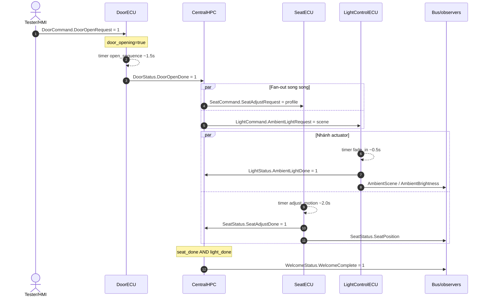

---

## 1. DoorECU — `door_ecu.yaml`

### Mục đích
Mở / đóng cửa hai chiều. Mỗi chuyển trạng thái (closed↔open) mất ~1.5s rồi mới publish Done.  
Open request khi **đã open** → ack `DoorOpenDone` ngay. Close request khi **đã closed** → ack `DoorCloseDone` ngay.  
Đang `opening` / `closing` → ignore request xung đột. `req != 1` → ignore.

### Xác nhận hiểu đúng (Q&A)

| Tình huống | Hành vi |
|------------|---------|
| Đã **open** + `DoorOpenRequest=1` | **TX `DoorOpenDone` ngay** (`already_open_ack`) — không chờ 1.5s |
| Đang **opening** + open/close req | **Ignore** (không rule match) |
| `DoorOpenRequest != 1` (và tương tự close) | **Ignore** path open/close start |
| Đã **open** + `DoorCloseRequest=1` | **Chờ ~1.5s** → `door_is_open=false` + **TX `DoorCloseDone`** |
| Đã **closed** + `DoorOpenRequest=1` | **Chờ ~1.5s** → open + **TX `DoorOpenDone`** (lại Case A) |

### Sequence hành vi (open + close cycle)

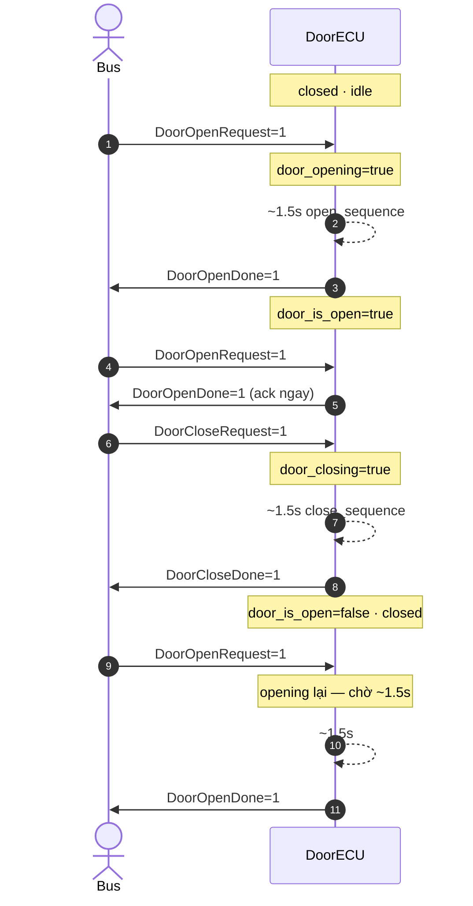

### Flow diagram

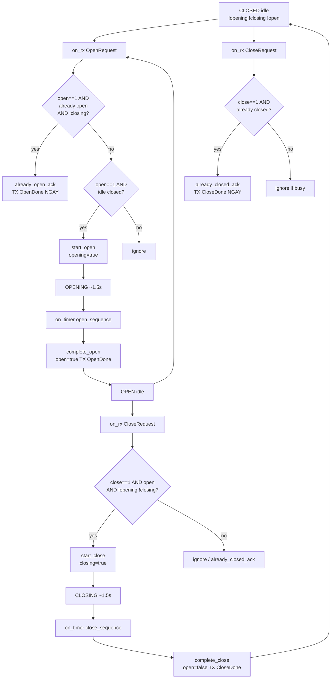

### Timeline — các case

| Case | Current state | Received signal | Waiting 1.5s? | Output |
|------|-----------|-------|-----------|--------|
| **A** Open from closed | closed idle | `OpenRequest=1` | **yes** | `OpenDone` + open |
| **B** Open when already open | open idle | `OpenRequest=1` | **No** | `OpenDone` intermediately |
| **C** Spam while opening | opening | any | — | ignore |
| **D** req ≠ 1 | any | open/close ≠1 | — | ignore |
| **E** Close from open | open idle | `CloseRequest=1` | **yes** | `CloseDone` + closed |
| **F** Close when already closed | closed idle | `CloseRequest=1` | **No** | `CloseDone` intermediately |
| **G** Open after close | closed (after E) | `OpenRequest=1` | **yes**  | = A |

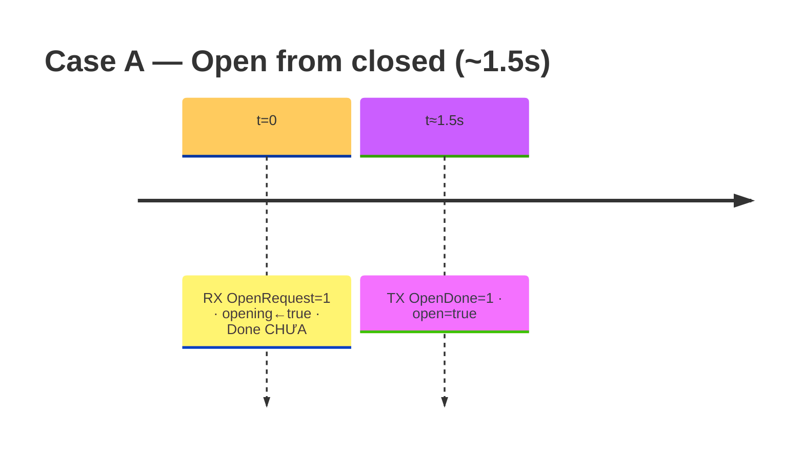

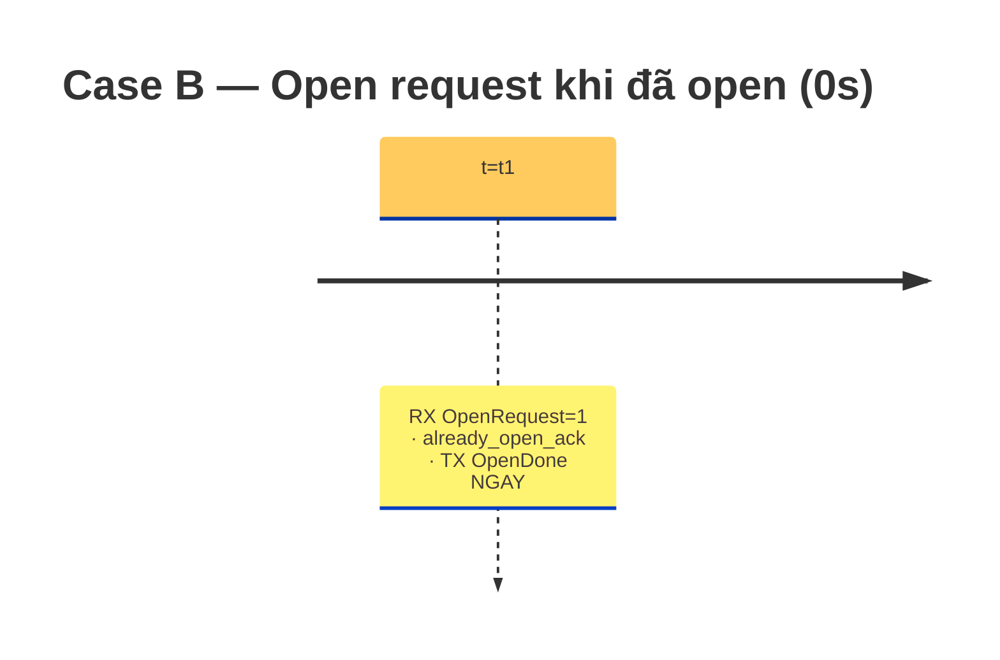

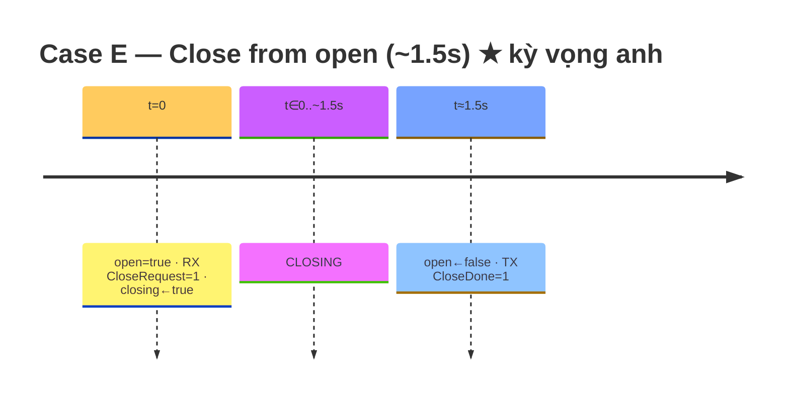

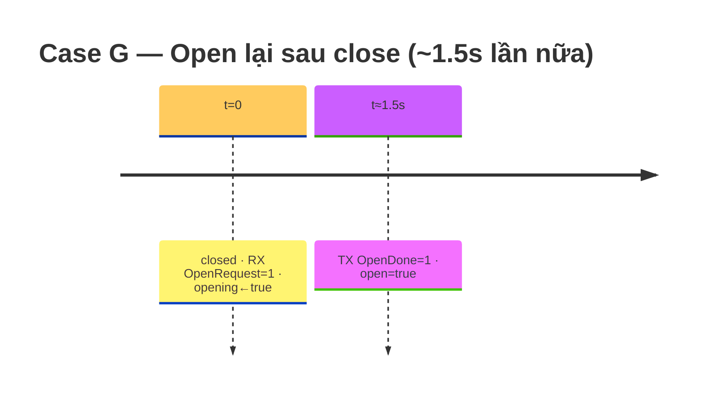

```mermaid
gantt
    title DoorECU A → B → E → G (unit 0.1s, 15≈1.5s)
    dateFormat X
    axisFormat %s
    section A open
    RX Open#1                      :milestone, r1, 0, 0
    opening                        :a1, 0, 15
    TX OpenDone#1                  :milestone, d1, 15, 0
    section B ack
    RX Open#2 + TX OpenDone#2 ngay :milestone, r2, 25, 0
    section E close
    RX Close#1                     :milestone, c1, 35, 0
    closing                        :e1, 35, 50
    TX CloseDone#1                 :milestone, cd1, 50, 0
    section G re-open
    RX Open#3                      :milestone, r3, 55, 0
    opening again                  :g1, 55, 70
    TX OpenDone#3                  :milestone, d3, 70, 0
```

SVG: [`../door_ecu_timeline_cases.svg`](../door_ecu_timeline_cases.svg).

### Giao diện (interfaces)

| Hướng | Signal | Ý nghĩa |
|-------|--------|---------|
| RX | `DoorCommand.DoorOpenRequest` | 1 = yêu cầu mở |
| RX | `DoorCommand.DoorCloseRequest` | 1 = yêu cầu đóng |
| TX | `DoorStatus.DoorOpenDone` | 1 = mở xong / ack đã mở |
| TX | `DoorStatus.DoorCloseDone` | 1 = đóng xong / ack đã đóng |

### Tham số (ROM)

| Tên | Kiểu | Giá trị | Ghi chú |
|-----|------|---------|---------|
| `open_sequence_sec` | float | 1.5 | Mirror interval open timer |
| `close_sequence_sec` | float | 1.5 | Mirror interval close timer |

### Trạng thái (RAM)

| Tên | Kiểu | Init | Ghi chú |
|-----|------|------|---------|
| `door_opening` | bool | false | Đang mở |
| `door_closing` | bool | false | Đang đóng |
| `door_is_open` | bool | false | true=open, false=closed (clear khi close xong) |

### Timer

| Tên | Chu kỳ | auto_start | Guard |
|-----|--------|------------|-------|
| `open_sequence` | 1.5 s | **true** | `$door_opening` |
| `close_sequence` | 1.5 s | **true** | `$door_closing` |

### Rules

| rule_id | Trigger | Condition (rút gọn) | Actions |
|---------|---------|---------------------|---------|
| `start_open_on_request` | `on_rx` OpenRequest | open==1 AND idle closed | `opening=true` |
| `complete_open_on_timer` | `on_timer` open_sequence | opening | open=true; TX OpenDone |
| `already_open_ack` | `on_rx` OpenRequest | open==1 AND already open AND !closing | TX OpenDone ngay |
| `start_close_on_request` | `on_rx` CloseRequest | close==1 AND open AND idle | `closing=true` |
| `complete_close_on_timer` | `on_timer` close_sequence | closing | open=false; TX CloseDone |
| `already_closed_ack` | `on_rx` CloseRequest | close==1 AND already closed idle | TX CloseDone ngay |

### Ghi chú hành vi
- **A open từ closed:** ~1.5s rồi `OpenDone`.
- **B open khi đã open:** `OpenDone` **ngay**.
- **E close từ open:** ~1.5s rồi `CloseDone` + `door_is_open=false` (đúng kỳ vọng anh).
- **G open sau close:** lại ~1.5s (vì đã closed).
- **C busy:** opening/closing → ignore open/close xung đột.
- **D** payload ≠ 1 → không start.

### Tiêu chí chấp nhận
1. **A:** closed + OpenReq → ~1.5s → OpenDone, open=true.
2. **B:** open + OpenReq → OpenDone immediate.
3. **E:** open + CloseReq → ~1.5s → CloseDone, open=false.
4. **G:** sau E + OpenReq → ~1.5s → OpenDone lại.
5. **C:** spam OpenReq khi opening → một OpenDone duy nhất.

---

## 2. CentralHPC — `central_hpc.yaml`

### Mục đích
Điều phối: khi cửa mở xong, gửi song song chỉnh ghế + bật ambient; chờ **cả hai** nhánh xong rồi kết thúc welcome.

### Sequence hành vi

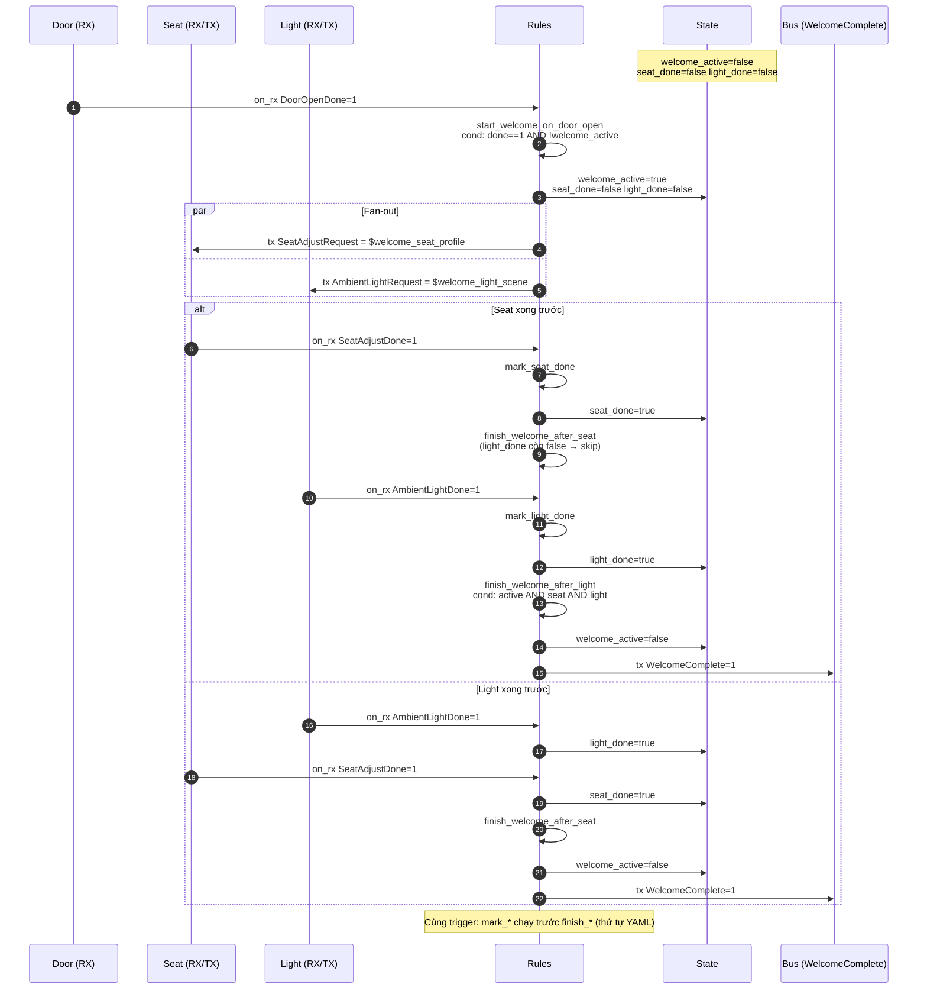

### Giao diện (interfaces)

| Hướng | Signal | Ý nghĩa |
|-------|--------|---------|
| RX | `DoorStatus.DoorOpenDone` | Nhánh cửa hoàn tất |
| RX | `SeatStatus.SeatAdjustDone` | Nhánh ghế hoàn tất |
| RX | `LightStatus.AmbientLightDone` | Nhánh đèn hoàn tất |
| TX | `SeatCommand.SeatAdjustRequest` | Profile id tới SeatECU |
| TX | `LightCommand.AmbientLightRequest` | Scene id tới LightControlECU |
| TX | `WelcomeStatus.WelcomeComplete` | Chuỗi welcome kết thúc |

### Tham số (ROM)

| Tên | Kiểu | Giá trị | Ghi chú |
|-----|------|---------|---------|
| `welcome_seat_profile` | int | 1 | Payload request ghế |
| `welcome_light_scene` | int | 2 | Payload request đèn |

### Trạng thái (RAM)

| Tên | Kiểu | Init | Ghi chú |
|-----|------|------|---------|
| `welcome_active` | bool | false | Đang trong chuỗi welcome |
| `seat_done` | bool | false | Cờ nhánh ghế |
| `light_done` | bool | false | Cờ nhánh đèn |

### Timer
Không có (`timers: []`). Thuần event-driven.

### Rules

| rule_id | Trigger | Condition | Actions |
|---------|---------|-----------|---------|
| `start_welcome_on_door_open` | `on_rx` `DoorStatus.DoorOpenDone` | `$DoorOpenDone == 1 AND $welcome_active == false` | `welcome_active=true`; xóa `seat_done`/`light_done`; **tx** `SeatAdjustRequest=$welcome_seat_profile`; **tx** `AmbientLightRequest=$welcome_light_scene` |
| `mark_seat_done` | `on_rx` `SeatStatus.SeatAdjustDone` | `$SeatAdjustDone == 1 AND $welcome_active == true` | `seat_done = true` |
| `mark_light_done` | `on_rx` `LightStatus.AmbientLightDone` | `$AmbientLightDone == 1 AND $welcome_active == true` | `light_done = true` |
| `finish_welcome_after_seat` | `on_rx` `SeatStatus.SeatAdjustDone` | `$welcome_active AND $seat_done AND $light_done` | `welcome_active=false`; **tx** `WelcomeComplete=1` |
| `finish_welcome_after_light` | `on_rx` `LightStatus.AmbientLightDone` | cùng bộ AND ba cờ | cùng hành vi kết thúc |

### Ghi chú hành vi
- **Fan-out:** một sự kiện cửa → hai request trong cùng rule (song song trên bus).
- **Join:** fire-all theo thứ tự YAML — mỗi RX done trước hết mark cờ, rồi rule finish kiểm tra lại cả hai cờ. Nhánh đến sau cùng sẽ hoàn tất chuỗi.
- Hai rule finish trùng logic trên cả hai signal done để join không phụ thuộc thứ tự đến.
- Bỏ qua seat/light done khi `welcome_active == false` (nhiễu / ngoài phiên).

### Lưu ý thứ tự (hợp đồng generator)
Các rule cùng trigger chạy **theo thứ tự YAML**. Trên `SeatAdjustDone`: `mark_seat_done` phải chạy **trước** `finish_welcome_after_seat` (như file hiện tại). Cặp light tương tự.

### Tiêu chí chấp nhận
1. `DoorOpenDone=1` → quan sát cả hai TX request với đúng profile/scene.
2. Chỉ seat done → chưa có `WelcomeComplete`.
3. Thêm light done → `WelcomeComplete=1`, `welcome_active=false`.
4. Đảo thứ tự seat/light done vẫn hoàn tất đúng một lần.

---

## 3. SeatECU — `seat_ecu.yaml`

### Mục đích
Nhận yêu cầu chỉnh ghế, “chạy” motion (timer), chốt vị trí theo driver-context, publish position + done.

### Sequence hành vi

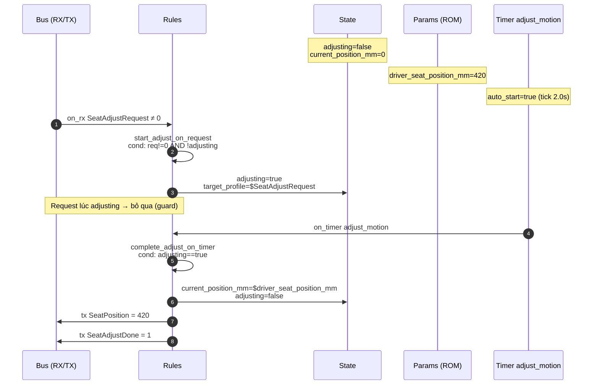

### Giao diện (interfaces)

| Hướng | Signal | Ý nghĩa |
|-------|--------|---------|
| RX | `SeatCommand.SeatAdjustRequest` | ≠0 = profile id / bắt đầu |
| TX | `SeatStatus.SeatAdjustDone` | 1 = motion xong |
| TX | `SeatStatus.SeatPosition` | Vị trí mm (quan sát) |

### Tham số (ROM)

| Tên | Kiểu | Giá trị | Ghi chú |
|-----|------|---------|---------|
| `driver_seat_position_mm` | int | 420 | Target áp dụng (ngữ cảnh tài xế) |
| `adjust_duration_sec` | float | 2.0 | Phản ánh interval timer |

### Trạng thái (RAM)

| Tên | Kiểu | Init | Ghi chú |
|-----|------|------|---------|
| `adjusting` | bool | false | Đang chỉnh |
| `current_position_mm` | int | 0 | Vị trí đã áp dụng gần nhất |
| `target_profile` | int | 0 | Payload request đã latch |

### Timer

| Tên | Chu kỳ | auto_start | Ghi chú |
|-----|--------|------------|---------|
| `adjust_motion` | 2.0 s | **true** | Chặn bằng `$adjusting` |

### Rules

| rule_id | Trigger | Condition | Actions |
|---------|---------|-----------|---------|
| `start_adjust_on_request` | `on_rx` `SeatCommand.SeatAdjustRequest` | `$SeatAdjustRequest != 0 AND $adjusting == false` | `adjusting=true`; `target_profile=$SeatAdjustRequest` |
| `complete_adjust_on_timer` | `on_timer` `adjust_motion` | `$adjusting == true` | `current_position_mm=$driver_seat_position_mm`; `adjusting=false`; **tx** `SeatPosition`; **tx** `SeatAdjustDone=1` |

### Ghi chú hành vi
- Lộ trình welcome: CentralHPC gửi profile `1` → latch → sau ~2 s publish position `420` + done.
- `target_profile` được lưu nhưng position luôn snap về `driver_seat_position_mm` (mock đơn giản; chưa map multi-profile).
- Request lúc đang `adjusting` bị bỏ qua đến khi idle.

### Tiêu chí chấp nhận
1. `SeatAdjustRequest=1` → ~2 s sau `SeatPosition=420` và `SeatAdjustDone=1`.
2. Request thứ hai trong lúc motion: không double-complete cho tới khi idle lại.

---

## 4. LightControlECU — `light_control_ecu.yaml`

### Mục đích
Nhận scene request, fade-in (timer), áp welcome brightness + scene, báo done.

### Sequence hành vi

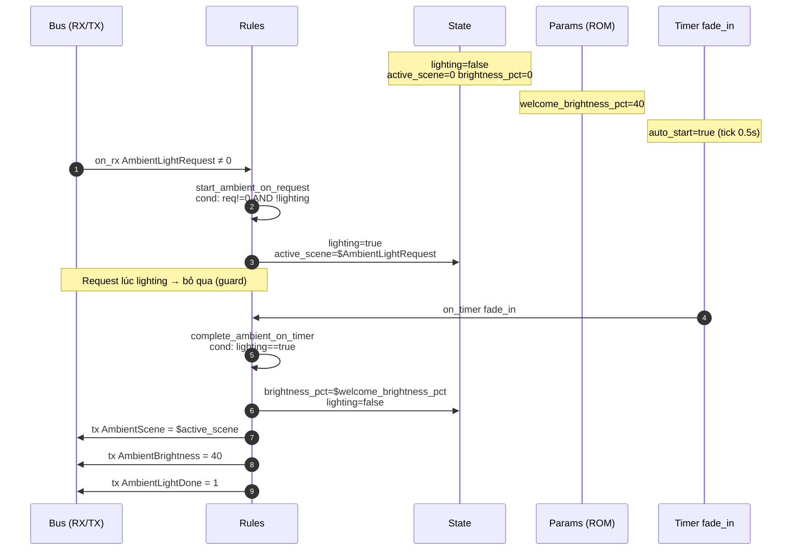

### Giao diện (interfaces)

| Hướng | Signal | Ý nghĩa |
|-------|--------|---------|
| RX | `LightCommand.AmbientLightRequest` | ≠0 = scene id / bắt đầu |
| TX | `LightStatus.AmbientLightDone` | 1 = đã áp scene |
| TX | `LightStatus.AmbientBrightness` | Độ sáng % (quan sát) |
| TX | `LightStatus.AmbientScene` | Scene đang active (quan sát) |

### Tham số (ROM)

| Tên | Kiểu | Giá trị | Ghi chú |
|-----|------|---------|---------|
| `welcome_brightness_pct` | int | 40 | Độ sáng áp dụng |
| `fade_in_sec` | float | 0.5 | Phản ánh interval timer |

### Trạng thái (RAM)

| Tên | Kiểu | Init | Ghi chú |
|-----|------|------|---------|
| `lighting` | bool | false | Đang fade-in |
| `active_scene` | int | 0 | Scene latch từ request |
| `brightness_pct` | int | 0 | Độ sáng đã áp gần nhất |

### Timer

| Tên | Chu kỳ | auto_start | Ghi chú |
|-----|--------|------------|---------|
| `fade_in` | 0.5 s | **true** | Chặn bằng `$lighting` |

### Rules

| rule_id | Trigger | Condition | Actions |
|---------|---------|-----------|---------|
| `start_ambient_on_request` | `on_rx` `LightCommand.AmbientLightRequest` | `$AmbientLightRequest != 0 AND $lighting == false` | `lighting=true`; `active_scene=$AmbientLightRequest` |
| `complete_ambient_on_timer` | `on_timer` `fade_in` | `$lighting == true` | `brightness_pct=$welcome_brightness_pct`; `lighting=false`; **tx** scene, brightness, **done=1** |

### Ghi chú hành vi
- Lộ trình welcome: scene `2` từ CentralHPC → sau ~0.5 s publish scene `2`, brightness `40`, done.
- Scene id lấy từ request; brightness luôn từ param ROM (cấu hình welcome).

### Tiêu chí chấp nhận
1. `AmbientLightRequest=2` → ~0.5 s sau `AmbientScene=2`, `AmbientBrightness=40`, `AmbientLightDone=1`.
2. Bỏ qua request tiếp khi đang `lighting`.

---

## Hợp đồng liên-ECU

| # | Signal | Producer | Consumer |
|---|--------|----------|----------|
| 1 | `DoorCommand.DoorOpenRequest` | Tester/HMI | DoorECU |
| 2 | `DoorStatus.DoorOpenDone` | DoorECU | CentralHPC |
| 3a | `SeatCommand.SeatAdjustRequest` | CentralHPC | SeatECU |
| 3b | `LightCommand.AmbientLightRequest` | CentralHPC | LightControlECU |
| 4a | `SeatStatus.SeatAdjustDone` | SeatECU | CentralHPC |
| 4b | `LightStatus.AmbientLightDone` | LightControlECU | CentralHPC |
| 5 | `WelcomeStatus.WelcomeComplete` | CentralHPC | Bus / observers |
| — | `SeatStatus.SeatPosition` | SeatECU | Bus (quan sát) |
| — | `LightStatus.AmbientScene` / `AmbientBrightness` | LightControlECU | Bus (quan sát) |

### Thời gian end-to-end (danh nghĩa)

```text
t=0      DoorOpenRequest
t≈1.5s   DoorOpenDone → SeatAdjustRequest + AmbientLightRequest
t≈2.0s   AmbientLightDone   (0.5s sau fan-out)
t≈3.5s   SeatAdjustDone     (2.0s sau fan-out)
t≈3.5s   WelcomeComplete
```

Light xong trước; join chờ seat.

### Sequence join (CentralHPC — hai thứ tự đến)

```mermaid
sequenceDiagram
    participant Seat
    participant Light
    participant HPC as CentralHPC

    Note over HPC: welcome_active=true sau fan-out

    rect rgb(245,245,245)
        Note over Seat,HPC: Case A — Light trước, Seat sau
        Light->>HPC: AmbientLightDone
        Note over HPC: light_done=true; join fail (thiếu seat)
        Seat->>HPC: SeatAdjustDone
        Note over HPC: seat_done=true; join OK → WelcomeComplete
    end

    rect rgb(245,245,245)
        Note over Seat,HPC: Case B — Seat trước, Light sau
        Seat->>HPC: SeatAdjustDone
        Note over HPC: seat_done=true; join fail (thiếu light)
        Light->>HPC: AmbientLightDone
        Note over HPC: light_done=true; join OK → WelcomeComplete
    end
```

### Khoảng trống dialect chung (cả 3 ECU actuator)
- Không có action `start_timer` / `stop_timer` → dùng `auto_start: true` + state guard.
- Expression `$SignalName` dạng ngắn vs full `Frame.Signal` — quy ước: condition dùng tên đoạn cuối; interfaces giữ `Frame.Signal`.
- `someip_tx: []` dự phòng; không dùng trong scenario này.

### Ngoài phạm vi các YAML này
- Topology / DBC / multi-bus namespaces  
- Named FSM, script, lookup table  
- Map multi-profile ghế, ramp motor thật, đường cong PWM đèn  
- Cài generator (các file này chỉ là **input**)
